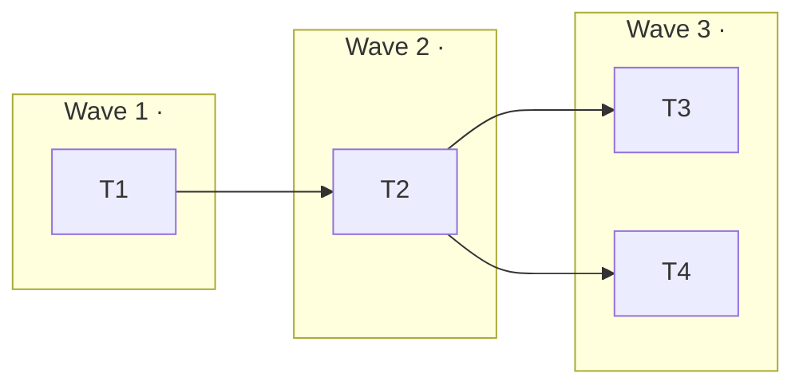

# Epic — <slug>

> **Spec:** [spec.md](../spec.md) · **Design:** [sad.md](../sad.md) · **Contract:** [openapi.yaml](../contracts/openapi.yaml) · **ADR:** [0001-<slug>.md](../adr/0001-<slug>.md)

## Goal
One sentence. The outcome, not the implementation.

## Scope
- **In:** <what this feature builds>
- **Out:** <what looks adjacent but belongs to another feature — name it>

## Task map

## Tasks
Status lives in [tracker.md](./tracker.md). Machine contract: [tasks.json](../tasks.json).

| # | Task | Layer | Wave | Blocked by | DoD (short) |
|---|---|---|---|---|---|
| T1 | <title> | domain | 1 | — | <one clause> |
| T2 | <title> | app | 2 | T1 | <one clause> |

## Waves
- **Wave 1 — <theme>.** <Why these tasks come first; what they unlock.>
- **Wave 2 — <theme>.** <…>

A wave groups tasks of one layer, so they land in one reviewable slice. It is **not** a promise
of independence: a `deps` edge inside a wave still orders those two tasks. Tasks in the same
wave with no edge between them may run in parallel, in separate worktrees, in any order.

## Risks / Hard rules
- **<Hard rule>:** <the constraint, and what breaks if it is ignored>.
- **<Risk>:** <what could go wrong> → <mitigation, or the ADR that settles it>.
- **Open question (spec §8):** <question> — agent MUST ask the human before T<N>.
  (Delete this bullet when the feature has no open question.)
