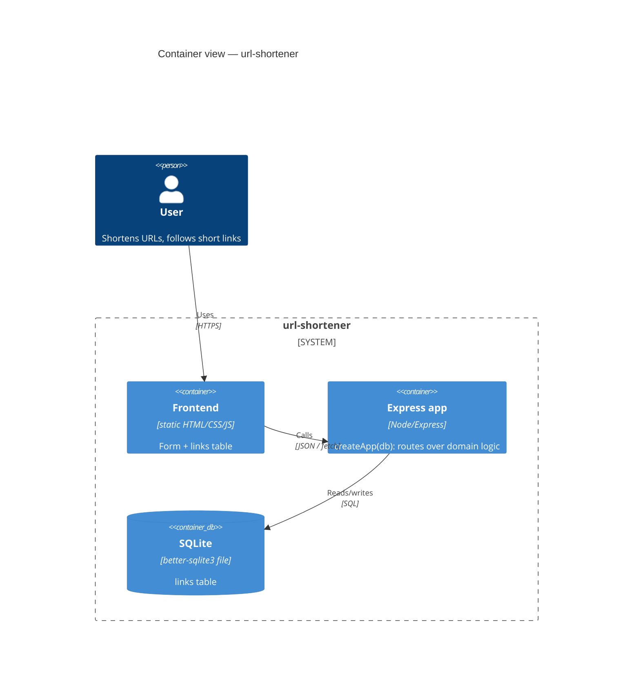

# Architecture map — url-shortener

> Single source of truth for conventions each feature must match. Read first before any task.

## Stack
Node (ESM, `type: module`) · Express 4 · Vitest (unit + integration, two projects) + supertest (integration HTTP seam) · Playwright (E2E) · SQLite via `better-sqlite3`. No build step; run with `node`. Lint: ESLint flat config (`eslint.config.js`). CI: GitHub Actions (`.github/workflows/gate.yml`) runs `npm run verify` across Linux/macOS/Windows × node 20/22.

## C4 — system as it is

## Module inventory

| Module | Path | Layers | Wired at | Responsibility |
|---|---|---|---|---|
| domain | `src/shorten.js` | domain | imported by app | code gen, create, resolve, list, stats — no HTTP |
| app | `src/app.js` | app/ports | `createApp(db)` | Express routes over domain; testable via supertest |
| db | `src/db.js` | infra | `openDb()` | SQLite open + schema migration |
| server | `src/server.js` | wiring | entrypoint | db + app + listen |
| web | `src/public/` | ui | static | frontend (form + links table) |
| tests | `tests/unit/`, `tests/integration/`, `tests/e2e/` | test | `test:fast` / `test:e2e` | three-level suite (domain, HTTP seam, browser) |

## Conventions (cited — the rules a new feature must match)
- **Domain vs HTTP:** new domain rule → `src/shorten.js`; routes stay thin in `src/app.js`.
- **Testability:** two seams. Domain functions (`src/shorten.js`) are tested directly over `openDb(':memory:')` in `tests/unit/`. The HTTP seam is driven through `createApp(openDb(':memory:'))` with supertest in `tests/integration/`. Both run browser-free via `npm run test:fast`; `tests/e2e/` drives the real frontend through Playwright (`npm run test:e2e`) against its own file DB.
- **Error shape:** `res.status(4xx).json({ error: '<short>' })`. Never throw bare strings.
- **Status codes:** 201 create · 302 redirect · 400 validation · 404 missing · 409 conflict · 410 expired · 429 rate-limit · 501 not-yet-built.
- **Migrations:** new column → separate idempotent `ALTER TABLE` in `src/db.js`; never edit base schema.
- **Route order:** `/api/*` routes are declared **above** the catch-all `GET /:code`; otherwise the catch-all swallows them.
- **Dependencies:** no new runtime dependency unless the feature's ADR explicitly accepts it.
- **TDD:** every task starts with a red test.

## Datastores
SQLite file `data/links.db` (gitignored). Base table `links(code TEXT PK, url TEXT, created_at INTEGER, clicks INTEGER)`. Features add columns via migrations.

## Frontend / UI foundation
Vanilla static page `src/public/` — CSS variables theme in `style.css`. Reuse these tokens/patterns; do not introduce a framework.

## Where things live / closest precedents
- New endpoint → route in `src/app.js` + logic in `src/shorten.js` (precedent: `POST /api/shorten`).
- New validation → guard in `src/shorten.js` (precedent: none yet — see feature `input-validation`).
- New column → migration in `src/db.js` (precedent: base `migrate()`).

## Constraints & known tech-debt
- No auth (single-user toy); AC "authorization" type is N/A for most features — note explicitly.
- No rate-limit yet.
- SQLite single-file — not for concurrent prod load (out of scope).
- **Stored URLs are unvalidated and rendered into `innerHTML`.** `POST /api/shorten` accepts any string (feature `input-validation` closes the write side), and `loadLinks()` in `src/public/app.js` interpolates the stored `url` straight into a row template. Until both ends are fixed, a stored `javascript:` scheme or markup payload reaches the DOM. The write side is scheduled; the read side is not — see `base-vertical` T4 edge cases.

## Reconciliation with the authored architecture doc
This map was authored at bootstrap (greenfield). Update `reflects_commit` when structure changes.
