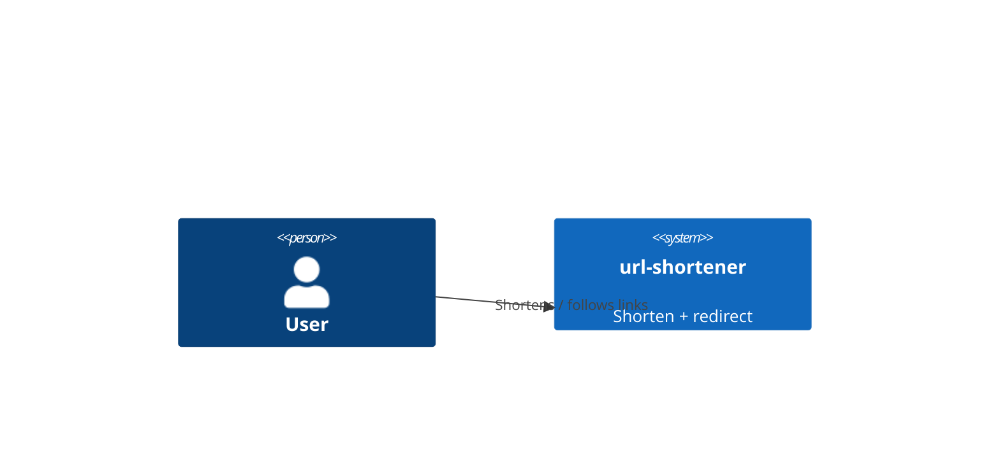
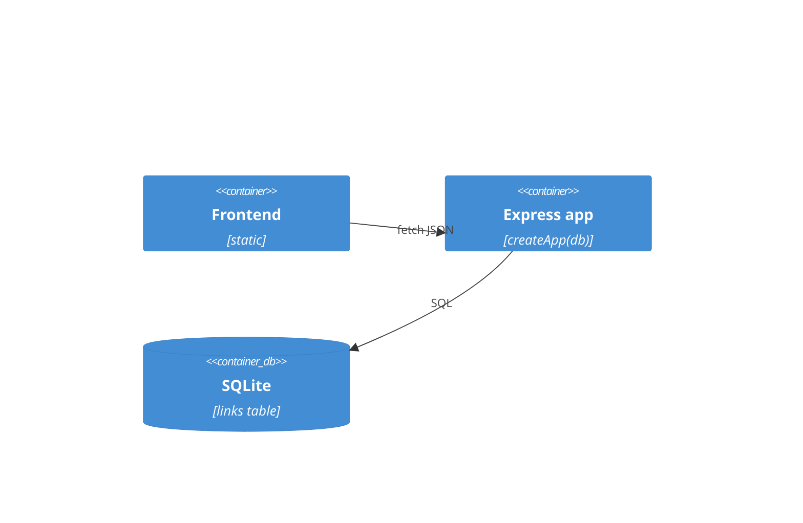
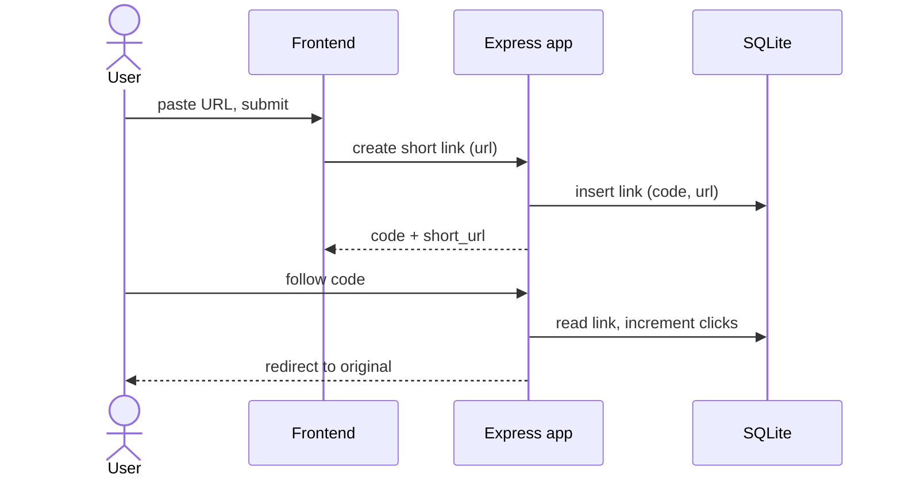

# Software Architecture Document — base-vertical

## 1. Introduction and goals
Smallest useful shortener slice: create a short code, redirect through it, count clicks, list links.
Top-3 quality goals: **correctness** (code↔url stable), **simplicity** (teachable), **reliability** (installs everywhere).

| Role | Interest | Sign-off owner? |
|---|---|---|
| Tech Lead | conventions upheld | Yes |
| Contributor | clear worked example of a full SDD pack | No |
| Visitor (demo) | shorten + follow works | No |

## 2. Constraints
**Technical:** Node ESM, Express 4, better-sqlite3, no build step.
**Organisational:** teaching artifact — favour clarity over optimisation.
**Conventions:** `docs/architecture-map.md` (domain/HTTP split, error shape, status codes).
**Regulatory:** none — public URLs only, no personal data.

## 3. Context and scope
User ↔ frontend ↔ Express API ↔ SQLite. No external systems.

**C4 Context (L1):**

## 4. Solution strategy
- Keep domain logic HTTP-free in `shorten.js` (→ ADR none needed, follows map).
- Single SQLite table, synchronous access (→ [0002-sqlite-better-sqlite3.md](../../adr/0002-sqlite-better-sqlite3.md)).
- base62/7 codes (→ [0001-base62-7-char-codes.md](../../adr/0001-base62-7-char-codes.md)).

## 5. Building block view
Layered: `db` (infra) ← `shorten` (domain) ← `app` (routes) ← `server` (wiring); `public` (ui).

## 6. Runtime view

## 7. Deployment view
<!-- N/A: local single-process node. -->

## 8. Crosscutting concepts
| Concept | Convention | Where defined |
|---|---|---|
| Errors | `{error}` JSON + status code | architecture-map |
| Logging | none yet (feature observability) | — |
| ID | base62/7 code | ADR 0001 |

## 9. Architecture decisions
| # | Title | Status | Section |
|---|---|---|---|
| 0001 | base62/7 codes | Accepted | §4 |
| 0002 | SQLite via better-sqlite3 | Accepted | §4 |

## 10. Quality requirements
**QG-1. Correctness** — **When** a link is followed **Then** its url never changes and clicks only rise. **How verify:** AC-04 unit test.
**QG-2. Reliability** — **When** a participant runs `npm install` **Then** it works with no native build. **How verify:** prebuilt better-sqlite3 (ADR 0002).

## 11. Risks and technical debt
| Risk/debt | Severity | Mitigation | Owner |
|---|---|---|---|
| No validation (open redirect) | Medium | feature `input-validation` | genkovich |

Accepted debt: no auth (single-user toy).

## 12. Glossary
| Term | Meaning |
|---|---|
| link / code / short_url / click | see `docs/CONTEXT.md` |
