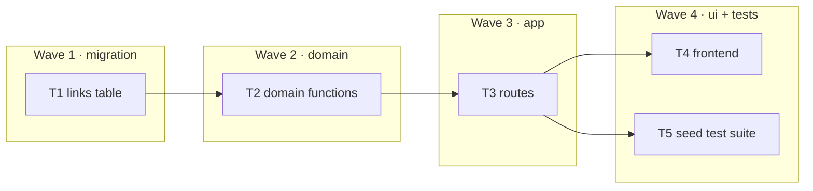

# Epic — base-vertical

> **Spec:** [spec.md](../spec.md) · **Design:** [sad.md](../sad.md) · **Contract:** [openapi.yaml](../contracts/openapi.yaml) · **ADRs:** [0001-base62-7-char-codes.md](../../../adr/0001-base62-7-char-codes.md), [0002-sqlite-better-sqlite3.md](../../../adr/0002-sqlite-better-sqlite3.md)

> **Status: shipped.** This epic is the worked example. Its tasks describe what was actually
> built, so `Data delta` and `API contract` are filled in from the code rather than from intent.
> Copy the shape onto your feature; do not copy the contents.

## Goal
Ship the smallest useful shortener slice — shorten, redirect and count, list — as a complete SDD package.

## Scope
- **In:** create, redirect + click counter, list, stats, frontend, the three-level seed test suite.
- **Out:** validation (feature `input-validation`), expiry (`link-expiry`), alias (`custom-alias`), auth (never — single-visitor toy).

## Task map

## Tasks
Status lives in [tracker.md](./tracker.md). Machine contract: [tasks.json](../tasks.json).

| # | Task | Layer | Wave | Blocked by | DoD (short) |
|---|---|---|---|---|---|
| T1 | links table + migrate | migration | 1 | — | `openDb` creates the schema; a fresh clone opens |
| T2 | domain functions | domain | 2 | T1 | 7-char code, collision guard, clicks monotonic |
| T3 | app routes | app | 3 | T2 | documented status codes; `/api/*` above the catch-all |
| T4 | frontend | ui | 4 | T3 | page renders, submits, lists |
| T5 | seed test suite | tests | 4 | T3 | `test:fast` (14) and `test:e2e` (1) green |

## Waves
- **Wave 1 — migration.** No layer above it can be tested until a schema exists.
- **Wave 2 — domain.** Written and tested before HTTP exists, and it never learns HTTP exists.
- **Wave 3 — app.** The last layer testable without a browser. `createApp(db)` is the seam the integration suite hangs on.
- **Wave 4 — ui + tests.** T4 and T5 have no edge between them and shipped in parallel.

## Risks / Hard rules
- **`/api/*` routes MUST be declared above the catch-all `GET /:code`.** Reverse them and `GET /api/links` becomes a lookup for a link whose code is `"api"` — a plausible `404` rather than a crash, which is why it survives review. See `docs/architecture-map.md` → Conventions → Route order.
- **Domain logic stays HTTP-free** in `src/shorten.js`. `src/app.js` contains no SQL.
- **The base schema is created inline** in `src/db.js`. Later features add columns through separate idempotent `ALTER TABLE` statements and never edit this `CREATE TABLE`.
- **A malformed JSON body is a `400`, not a `500`.** The error middleware honours `err.status` from `express.json()`. Losing that turns a client typo into a fake outage.
- **Known hole, deliberately left open:** nothing validates the submitted URL, so `POST /api/shorten` will happily store `javascript:…` and the frontend interpolates the stored URL into `innerHTML`. Both ends are recorded in T3 and T4 edge cases; the write side is closed by `input-validation`.
