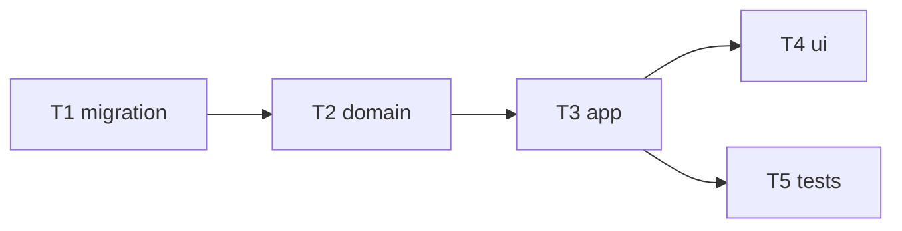

# Epic — base-vertical

> **Spec:** [spec.md](../spec.md) · **Design:** [sad.md](../sad.md) · **ADRs:** [0001-base62-7-char-codes.md](../../../adr/0001-base62-7-char-codes.md), [0002-sqlite-better-sqlite3.md](../../../adr/0002-sqlite-better-sqlite3.md)

## Goal
Ship the smallest useful shortener slice (shorten + redirect + list) as a worked SDD example.

## Scope
- **In:** create, redirect+count, list, stats; frontend; seed tests.
- **Out:** validation, expiry, alias, auth.

## Task map

## Tasks
See [tracker.md](./tracker.md) for status. Machine contract: [tasks.json](../tasks.json).

| # | Task | Layer | Blocked by | DoD (short) |
|---|---|---|---|---|
| T1 | links table + migrate | migration | — | table created |
| T2 | domain functions | domain | T1 | code/create/resolve/list/stats |
| T3 | app routes | app | T2 | documented status codes |
| T4 | frontend | ui | T3 | page works |
| T5 | seed tests | tests | T3 | npm run test:fast green |

## Risks / Hard rules
- `/api/*` routes MUST be declared above catch-all `GET /:code` (see `docs/architecture-map.md` → Conventions → Route order).
- Domain logic stays HTTP-free in `shorten.js`.
