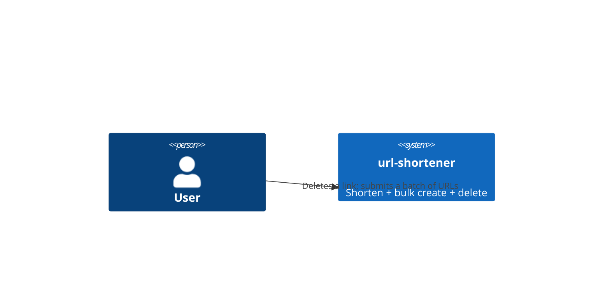
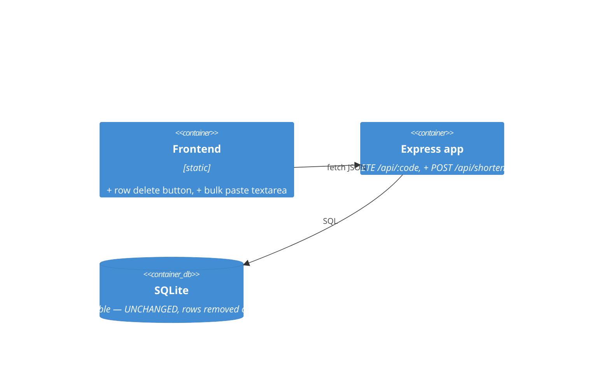
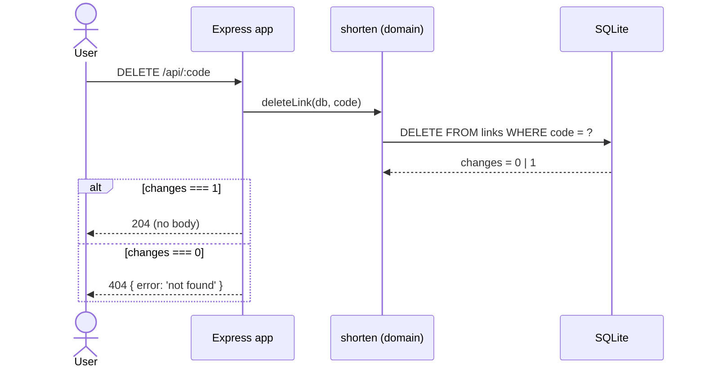
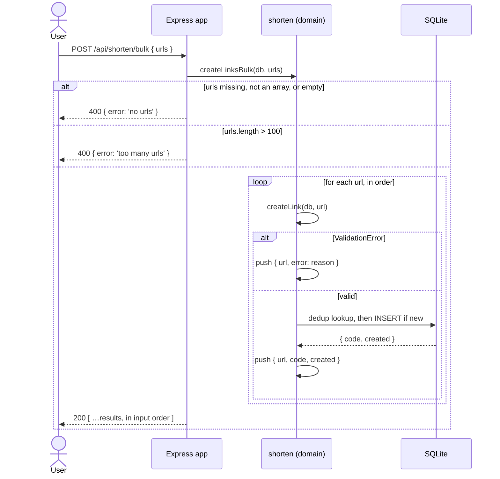

# Software Architecture Document — bulk-and-delete

## 1. Introduction and goals
Remove a link for good, and create many at once without letting one bad URL sink the rest.
Quality goals: **no ghost rows** (a deleted link leaves nothing behind, so no future query has to remember to exclude it), **per-item isolation** (a refusal is data, not an exception that reaches the caller), **no new rule** (validation and de-duplication are borrowed from `input-validation`, not re-implemented).

| Role | Interest | Sign-off owner? |
|---|---|---|
| Tech Lead | no migration; no invisible predicate added to existing reads; the batch cannot half-write | Yes |
| Visitor | a link that is gone is gone; a batch tells them exactly which URLs failed | No |
| Contributor | a worked example of a destructive operation and of an endpoint that returns per-item outcomes | No |

## 2. Constraints
**Technical:** Node ESM, Express 4, better-sqlite3 (per architecture-map). No new dependency: a `DELETE` statement and a `for` loop are enough.
**Organisational:** delete is irreversible and unauthenticated. Whatever this feature gets wrong, the visitor cannot undo.
**Conventions:** new domain rule → `src/shorten.js`; routes stay thin in `src/app.js`. Error shape `{ error: '<short>' }`. Status codes from architecture-map: `400` validation, `404` missing. `204` is new to this service and is the only status here with no body.
**Regulatory:** none.

## 3. Context and scope
Same actors as base-vertical. External systems: none.

**C4 Context (L1):**

## 4. Solution strategy

- **Hard delete.** `deleteLink(db, code)` issues one `DELETE FROM links WHERE code = ?` and returns a boolean: `true` when a row was removed, `false` when the code was not there. The driver already answers this question — `.run()` reports `changes` as `1` or `0` (measured) — so the domain never needs a `SELECT` first. No column, no migration, no tombstone (→ [0001-hard-delete.md](adr/0001-hard-delete.md)).
- **Bulk create is a loop over the create that already exists.** `createLinksBulk(db, urls)` checks the two batch-level rules, then calls `createLink` once per URL, catching `ValidationError` per item. Validation, trimming and URL de-duplication are `input-validation`'s, unchanged and uncopied. The batch adds only ordering and error containment.
- **Both batch guards run before the loop.** `urls` absent, not an array, or empty → `no urls`. More than 100 entries → `too many urls`. Neither guard touches the store, and both stand between the request and the first `INSERT`. Checked afterwards — or, worse, inside the loop — a 101-item batch would leave 100 links behind and still answer `400`.
- **No transaction around the loop.** Each `createLink` autocommits. This is what makes partial success work at the storage layer, not only in the response body. Wrapping the loop in `db.transaction()` and letting one `ValidationError` escape rolls the whole batch back: measured, two successful inserts became zero rows. The loop catches per item, so nothing escapes — but the wrapper would be a loaded gun aimed at exactly the property this feature exists to provide.
- **`POST /api/shorten/bulk` answers `200`, never `207`.** The bulk request succeeded: the server attempted every create it was asked to attempt. Which individual URLs were refused is *data*, and it is already in the body, one entry per input entry.
  `207 Multi-Status` is the obvious alternative and it is the wrong one. It is a WebDAV extension (RFC 4918 §11.1), and the response it names is a `multistatus` XML document (§13). Sending a JSON array under it borrows the number without the contract that gives the number meaning. Worse, it buys nothing: a client that does not implement WebDAV treats an unrecognised `2xx` as a plain `200`, and a client that does implement it will look for XML and find none. Either way the caller must read the body to learn anything.
  The honest cost of `200`: a caller who checks only the status code cannot distinguish "100 created" from "1 created, 99 refused". We accept it. The array is the answer, and a caller who ignores the array was never going to handle partial failure.
- **`DELETE /api/:code` replaces its own `501` stub, and it goes last among the `/api` routes.** It matches any single-segment path under `/api`, including paths that do not exist yet (§8, and the hard rules in [tasks/_epic.md](tasks/_epic.md)).
- The frontend grows a delete button per row and a textarea that pastes one URL per line.

## 5. Building block view
No new module — extends `shorten` (two functions), `app` (two routes), `public` (a button and a textarea).

## 6. Runtime view

Delete — one statement, and the boolean it returns is the whole answer:

Bulk — the guards stand outside the loop; the loop never throws:

## 7. Deployment view
<!-- N/A: same local single-process runtime as base-vertical. -->

## 8. Crosscutting concepts
| Concept | Convention | Where defined |
|---|---|---|
| Errors | `400 { error }` for a refused batch, `404 { error: 'not found' }` for an unknown code | architecture-map status codes |
| Empty responses | `204` and no body; `res.status(204).json(x)` discards `x` silently | spec §6 (measured) |
| Batch guards | `no urls` and `too many urls`, both before the first write | spec §5 AC-04, AC-05 |
| Partial success | `200` + one result per input entry, positionally aligned | this SAD §4; `207` rejected there |
| Validation & dedup | borrowed whole from `input-validation` (`validateUrl`, `createLink`) | [input-validation spec §5](../input-validation/spec.md#5-acceptance-criteria) AC-07 |
| Delete semantics | hard; the row and its click count are destroyed together | [ADR 0001](adr/0001-hard-delete.md) |
| Route order | literal `DELETE /api/…` routes above `DELETE /api/:code`; `GET /:code` stays last | architecture-map, Conventions → Route order |

## 9. Architecture decisions
| # | Title | Status | Section |
|---|---|---|---|
| 0001 | Hard delete, no tombstone column | Accepted | §4 |

## 10. Quality requirements
**QG-1. No ghost rows** — **When** a link is deleted **Then** no row and no marker survives, and no existing read (`listLinks`, `resolveLink`, `getStats`) gains a filter clause. **How verify:** AC-08 test counts rows directly and asserts the freed code can be inserted again; a reviewer greps the three readers for a new `WHERE` term.

**QG-2. Partial success is real, not cosmetic** — **When** a batch contains one invalid URL **Then** the valid neighbours exist as rows after the request, not merely as `created: true` in the body. **How verify:** AC-06 test reads `GET /api/links` afterwards, not the response body.

**QG-3. Nothing is written above the limit** — **When** a 101-item batch is submitted **Then** the row count is unchanged. **How verify:** AC-04 test counts rows before and after, and the count is the assertion — the `400` is not.

**QG-4. The catch-all delete stays last** — **When** a literal `DELETE /api/<path>` route is added **Then** it is declared above `DELETE /api/:code`. **How verify:** cannot be verified by a test, because the route that would break is the one that does not exist yet. Enforced by a comment in `src/app.js` and by the hard rule in the epic. A test pins today's behaviour instead: `DELETE /api/links` answers `404 { error: 'not found' }`, which proves it reaches the parameterised route.

## 11. Risks and technical debt
| Risk/debt | Severity | Mitigation | Owner |
|---|---|---|---|
| Delete is irreversible and unauthenticated | High | Accepted (single-visitor toy). The frontend asks for confirmation; that is the only guard, and it lives in the browser. First thing to fix in any multi-user version. | genkovich |
| A future literal `DELETE /api/links` lands below `DELETE /api/:code` and is silently swallowed | Medium | Comment in `src/app.js`, hard rule in the epic, and a test that documents the swallow. No test can catch the mistake itself — see QG-4. | genkovich |
| A freed code is re-claimed as an alias; an old shared link now points elsewhere | Medium | Accepted, named in ADR 0001. Mitigation would be a reserved-tombstone list, which is soft delete under another name. | genkovich |
| Click history vanishes with the row | Low | Accepted. Metrics beyond a counter are out of scope (`docs/CONTEXT.md`). | genkovich |
| 100 maximum-length URLs cannot fit under the 100 kB body limit | Low | Documented (spec §6, §8). `413 { error: 'bad request' }` is a truthful answer; the limit is shared by every route and is not widened here. | genkovich |
| 100 autocommitted inserts per batch | Low | `src/db.js` runs the database in WAL mode, so each commit appends rather than rewriting a journal. No transaction is introduced: it would trade this cost for the loss of partial success (§4). | genkovich |

Accepted debt: no bulk delete; no undo; no per-item `413` — an oversized batch is refused whole, by the parser, before the route can say anything more useful.

## 12. Glossary
| Term | Meaning |
|---|---|
| hard delete | removing the row itself, as opposed to marking it deleted and filtering it out of every read |
| tombstone | the row that soft delete leaves behind; it holds the primary key forever |
| batch | the array of URLs in one `POST /api/shorten/bulk` request; 1 … 100 entries |
| result entry | one element of the response array; describes the input URL at the same index |
| partial success | a `200` batch in which some entries carry a code and others carry an error |
