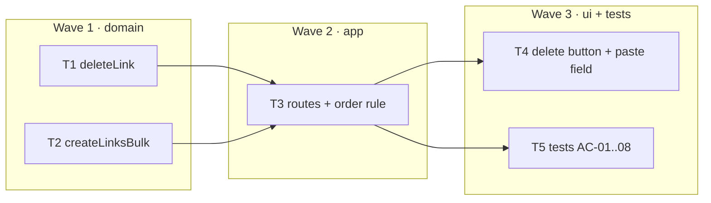

# Epic — bulk-and-delete

> **Spec:** [spec.md](../spec.md) · **Design:** [sad.md](../sad.md) · **Contract:** [openapi.yaml](../contracts/openapi.yaml) · **Test plan:** [test-plan.md](../test-plan.md) · **ADR:** [0001-hard-delete.md](../adr/0001-hard-delete.md)

## Goal
Let a link be removed for good, and let a hundred be created in one request without one bad URL sinking the other ninety-nine. No migration: hard delete adds no column, and bulk adds no rule that `input-validation` does not already own.

## Scope
- **In:** `deleteLink` (hard, boolean outcome), `createLinksBulk` (two guards, ordered loop, per-item errors), `DELETE /api/:code` (`204`/`404`), `POST /api/shorten/bulk` (`200`/`400`), a row delete button, a paste field.
- **Out:** undo or trash; bulk delete (`DELETE /api/links` — named only so the route table is arranged to accept it later); ownership checks; keeping click history past deletion; raising the 100 kB body limit; aliases inside a batch.

## Task map

## Tasks
Status lives in [tracker.md](./tracker.md). Machine contract: [tasks.json](../tasks.json).

| # | Task | Layer | Wave | Blocked by | DoD (short) |
|---|---|---|---|---|---|
| T1 | `deleteLink` | domain | 1 | — | one `DELETE`, boolean from `changes`; no tombstone, no filter anywhere |
| T2 | `createLinksBulk` | domain | 1 | — | both guards before the first insert; order preserved; no transaction |
| T3 | routes | app | 2 | T1, T2 | `204` with no body; `DELETE /api/:code` declared last among `/api` deletes |
| T4 | delete button + paste field | ui | 3 | T3 | `confirm()` before delete; never `res.json()` on a `204` |
| T5 | tests AC-01..08 | tests | 3 | T3 | `npm run test:fast` green; every store assertion counts rows |

## Waves
- **Wave 1 — domain.** Delete destroys state and bulk half-succeeds; both are settled before HTTP exists. **T1 and T2 are parallel by the graph and serial by the file.** Their `deps` are both `[]` — neither calls the other, and either can be written first — but both land in `src/shorten.js`. Two agents on this wave will collide on one file, not on one function. Sequence them, or accept the merge.
- **Wave 2 — app.** Two routes, one of which replaces a `501` stub. The only architectural act in the whole feature is *where* `DELETE /api/:code` is declared.
- **Wave 3 — ui + tests.** T4 and T5 have no edge between them and may run in parallel.

## Risks / Hard rules

- **Literal `DELETE` routes go above `DELETE /api/:code`.** The parameterised route matches **any** single-segment path under `/api`. Measured on today's code: `DELETE /api/links` already returns `501 {"error":"not implemented","feature":"bulk-and-delete"}` — the stub at `src/app.js:44` matched it with `code = "links"`. When bulk delete is eventually built, its route must be declared *before* this one. No test can catch the mistake: the route that breaks is the one that does not exist yet. Hence a comment in `src/app.js`, this rule, and a test that pins the swallow (`DELETE /api/links` → `404 not found`).

- **`POST /api/shorten/bulk` needs no ordering care, and the opposite is a myth.** `POST /api/shorten` does **not** swallow it. Measured (express 4.22.2): with both routes registered, `POST /api/shorten/bulk` reaches the bulk handler, and with only `POST /api/shorten` registered it answers `404`. A literal path does not match a longer one, and an Express path parameter never spans `/`. Do not add an ordering rule that the framework does not need — and do not repeat the claim that it does.

- **Both batch guards run before the first write.** `no urls` and `too many urls` are checked at the top of `createLinksBulk`, before the loop. Check the limit afterwards and a 101-item batch answers `400` having already created 100 links. The `400` would look correct in every test that reads only the status code. T5 counts rows.

- **Never wrap the loop in a transaction.** Measured: inside `db.transaction()`, one throw rolls the batch back and two successful inserts became zero rows. Partial success is the point of this endpoint; a transaction is the one construct that cannot coexist with it. Each `createLink` autocommits, and the `catch` sits inside the loop, per item.

- **Catch `ValidationError`, nothing else.** A `catch {}` around each item turns a disk failure into `{ url, error: '…' }` inside a `200`. Any error that is not a `ValidationError` propagates out of `createLinksBulk` and becomes a `500`, which is what it is.

- **A duplicate inside one array is not the same case as a duplicate in the table.** The second occurrence's dedup `SELECT` must see the row the *first* occurrence inserted moments earlier, in the same request. Measured: better-sqlite3 sees its own writes, in autocommit and inside a transaction alike. Two natural implementations break this — collecting the inserts to run after the loop, and reading the URL→code map once before it. Both create two rows for one URL and both pass a test that checks only `created`.

- **A `204` has no body.** `res.status(204).json({ ok: true })` sends nothing: no payload, no `content-type` (measured). Write `res.status(204).end()` and never an acceptance criterion about a delete response body. On the browser side, `await res.json()` on that response throws `SyntaxError: Unexpected end of JSON input` (measured) — T4's delete handler must not call it.

- **The batch's real ceiling is bytes, not items.** `express.json()` defaults to 100 kB. Fifty URLs at the 2048-character maximum make a 102 560-byte body and Express answers `413`, rendered by this app's error middleware as `{ error: 'bad request' }` — the route never runs. The 100-item limit is only observable with short URLs. Any test of `too many urls` that uses long URLs asserts the wrong error.

- **Deleting a code frees it.** Measured: SQLite re-accepts a primary key whose row was deleted. Once `custom-alias` ships, a visitor can claim `launch-2026` the day after someone else deleted it, and a poster printed with that short URL now points at a stranger's address. Accepted, and named in ADR 0001: the alternative is a permanent list of every code ever deleted, which is a tombstone with the word removed.

- **No migration.** If this feature finds itself writing `ALTER TABLE`, it has drifted into soft delete and the design is gone.
