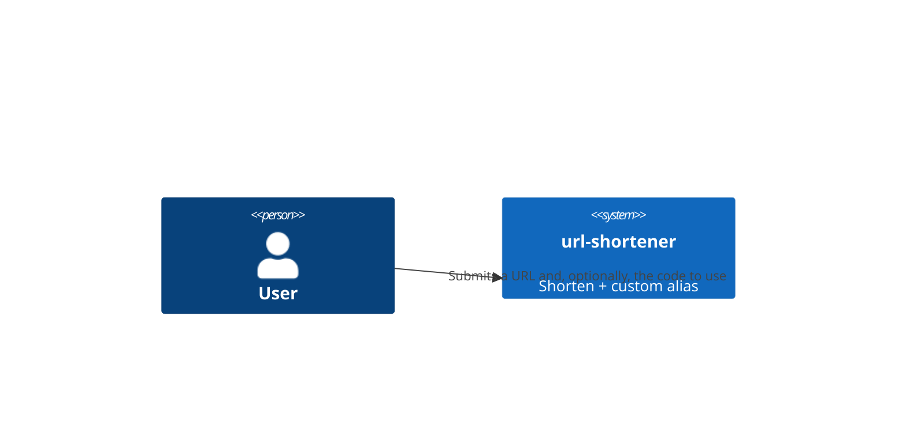
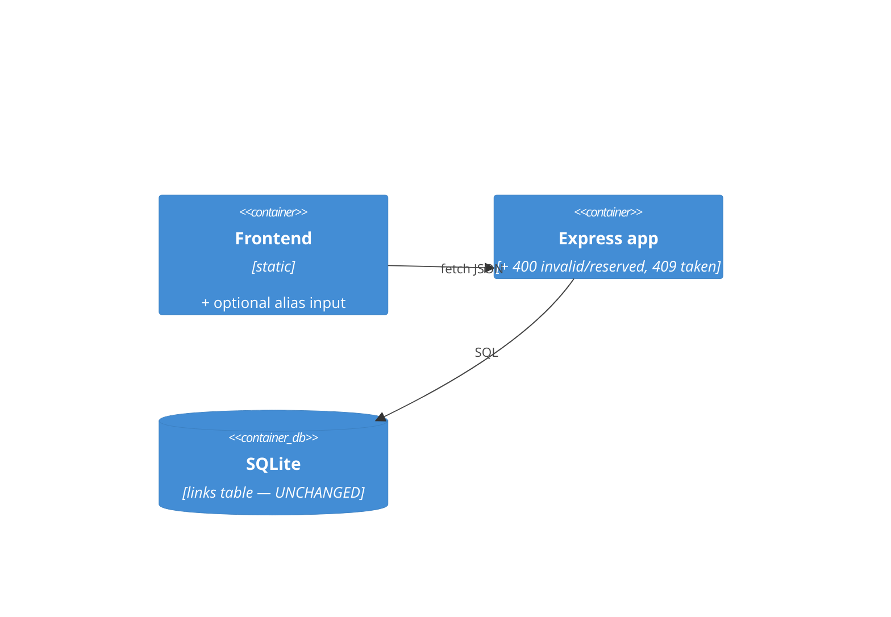
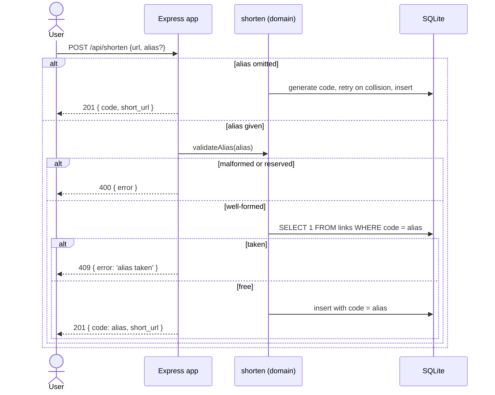

# Software Architecture Document — custom-alias

## 1. Introduction and goals
Let the visitor choose the code. The alias *is* the code: same column, same primary key, same path segment.
Quality goals: **safety** (no alias can shadow a route or bend a URL path), **no schema change** (the key already exists), **indistinguishable behaviour** (an aliased link is just a link).

| Role | Interest | Sign-off owner? |
|---|---|---|
| Tech Lead | no migration, no second identity column, allowlist not blocklist | Yes |
| Visitor | readable short links; a clear reason when an alias is refused | No |
| Contributor | a worked example of a feature that changes a key without a migration | No |

## 2. Constraints
**Technical:** Node ESM, Express, better-sqlite3 (per architecture-map). No new dependency — a regular expression and a `Set` are enough.
**Organisational:** the code is a public, permanent handle. A rule that lets a bad alias through cannot be fixed later without breaking links.
**Conventions:** new validation → guard in `src/shorten.js`; routes stay thin. Error shape `{ error: '<short>' }`. Status codes from architecture-map: `400` validation, `409` conflict.
**Regulatory:** none.

## 3. Context and scope
Same actors as base-vertical. External systems: none.

**C4 Context (L1):**

## 4. Solution strategy
- **The alias is the code.** `links.code` is already `TEXT PRIMARY KEY`; an alias is simply a code the visitor chose instead of one `generateCode()` chose. No new column, no migration, no second uniqueness rule (→ [0001-alias-as-code.md](adr/0001-alias-as-code.md)).
- Add a pure domain guard `validateAlias(raw)` in `src/shorten.js`: character allowlist `^[A-Za-z0-9_-]{3,32}$`, then a case-insensitive reserved-name check. It returns the alias verbatim or throws a typed error.
- `createLink` grows an optional `alias`. With an alias it takes the *claim* branch: validate, check the key is free, insert — and never de-duplicate on the URL. Without one it keeps today's generate-and-retry branch.
- `POST /api/shorten` maps the outcomes: `201` created, `400` invalid or reserved, `409` taken.
- The frontend adds one optional input beside the URL field.

## 5. Building block view
No new module — extends `shorten` (guard + claim branch), `app` (400/409 mapping), `public` (one input).

## 6. Runtime view

## 7. Deployment view
<!-- N/A: same local single-process runtime as base-vertical. -->

## 8. Crosscutting concepts
| Concept | Convention | Where defined |
|---|---|---|
| Errors | `400` invalid/reserved, `409` taken, both `{ error }` | architecture-map status codes |
| Alias shape | allowlist `^[A-Za-z0-9_-]{3,32}$` | ADR 0001, spec §6 |
| Reserved names | `api`, `healthz`, `metrics`, compared case-insensitively | spec §6 |
| Case | uniqueness case-sensitive; reserved check case-insensitive | spec §6 |
| Dedup | skipped whenever an alias is requested | spec §5 AC-07 |

## 9. Architecture decisions
| # | Title | Status | Section |
|---|---|---|---|
| 0001 | The alias is the code, not a second column | Accepted | §4 |

## 10. Quality requirements
**QG-1. Reachability** — **When** an alias is accepted **Then** `GET /<alias>` reaches the link, never a service route. **How verify:** AC-04 test, including `HEALTHZ` in upper case.
**QG-2. No overwrite** — **When** a taken alias is claimed **Then** the request is refused and the existing row is byte-identical afterwards. **How verify:** AC-05 test asserts the stored URL and click count are unchanged.
**QG-3. Backwards-compat** — **When** no alias is given **Then** creation behaves exactly as before. **How verify:** AC-02 test plus the unmodified seed suites.

## 11. Risks and technical debt
| Risk/debt | Severity | Mitigation | Owner |
|---|---|---|---|
| A future static file with no extension shadows an alias | Low | `src/public/` holds only extensioned files; a linter rule or a reserved-name entry if that ever changes | genkovich |
| A future route added above the catch-all shadows a live alias | Medium | The reserved list must grow with the route table. Recorded in the epic's hard rules. | genkovich |
| Alias squatting | Low | Accepted — single-visitor toy, no accounts | genkovich |
| `Foo` vs `foo` confuses a visitor | Low | Documented in §6; folding them would silently break existing generated codes | genkovich |

Accepted debt: no way to release or rename an alias; no reservation without a link.

## 12. Glossary
| Term | Meaning |
|---|---|
| alias | a code the visitor chose, rather than one the service generated (see `docs/CONTEXT.md`) |
| reserved name | an alias refused because a service path already answers on it |
| claim | the create branch taken when an alias is supplied: validate, check free, insert; never dedup |
