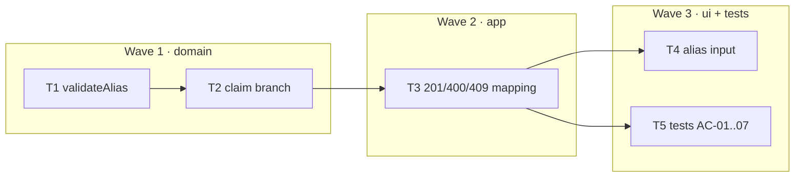

# Epic — custom-alias

> **Spec:** [spec.md](../spec.md) · **Design:** [sad.md](../sad.md) · **Contract:** [openapi.yaml](../contracts/openapi.yaml) · **Test plan:** [test-plan.md](../test-plan.md) · **ADR:** [0001-alias-as-code.md](../adr/0001-alias-as-code.md)

## Goal
Let the visitor choose the code. The alias *is* the code — same column, same primary key, same path segment, no migration.

## Scope
- **In:** `validateAlias` guard (charset allowlist + reserved names), the claim branch in `createLink`, `201`/`400`/`409` mapping, one optional form input.
- **Out:** renaming or releasing an alias, reserving an alias without a link, per-user namespaces, case-folding `Foo` into `foo`.

## Task map

## Tasks
Status lives in [tracker.md](./tracker.md). Machine contract: [tasks.json](../tasks.json).

| # | Task | Layer | Wave | Blocked by | DoD (short) |
|---|---|---|---|---|---|
| T1 | `validateAlias` | domain | 1 | — | anchored allowlist; reserved names, case folded |
| T2 | claim branch | domain | 1 | T1 | alias becomes the code; taken → throw, zero writes |
| T3 | `201`/`400`/`409` | app | 2 | T2 | `409` only for a taken alias; `GET /:code` untouched |
| T4 | alias input | ui | 3 | T3 | empty field omits the key entirely |
| T5 | tests AC-01..07 | tests | 3 | T3 | `npm run test:fast` green, both boundaries, no overwrite |

## Waves
- **Wave 1 — domain.** The alias becomes a permanent public path segment, so it is validated and claimed before HTTP exists. T2 depends on T1; they are ordered inside the wave, not parallel.
- **Wave 2 — app.** One request field, one new status code, zero rules.
- **Wave 3 — ui + tests.** T4 and T5 have no edge between them and may run in parallel.

## Risks / Hard rules
- **Allowlist, anchored.** `^[A-Za-z0-9_-]{3,32}$`. Drop the anchors and `bad/launch-2026` matches on its `bad` substring — the alias would carry a path separator into the primary key. T5 pins this with `slash/name`.
- **The reserved check folds case; uniqueness does not.** Express matches `GET /HEALTHZ` to the `/healthz` handler (measured), so `Healthz` must be refused. SQLite compares `TEXT PRIMARY KEY` with the binary collation (measured), so `Foo` and `foo` stay two links. The asymmetry is not elegant; it is what the two layers underneath actually do.
- **The reserved list must grow with the route table.** Add a route above the catch-all `GET /:code` and any live alias with that name becomes unreachable — silently, with no failing test. Whoever adds the route adds the reserved name.
- **A taken alias writes nothing.** Probe the key, throw `AliasError('alias taken')`, and never let the `INSERT` decide. T5 asserts the existing row is byte-identical afterwards, because a `409` says nothing about what survived.
- **An alias bypasses URL de-duplication** (`input-validation` AC-07). Asking for a handle is asking for a new link, not for the one that already happens to point there.
- **An empty alias field omits the key.** Sending `alias: ""` routes into the claim branch and gets refused as `invalid alias` — a refusal for a field the visitor never filled in. One line in T4, and the whole feature's usability rests on it.
- **No migration.** `links.code` already is the primary key. If this feature finds itself writing SQL, the design has drifted from ADR-0001.
