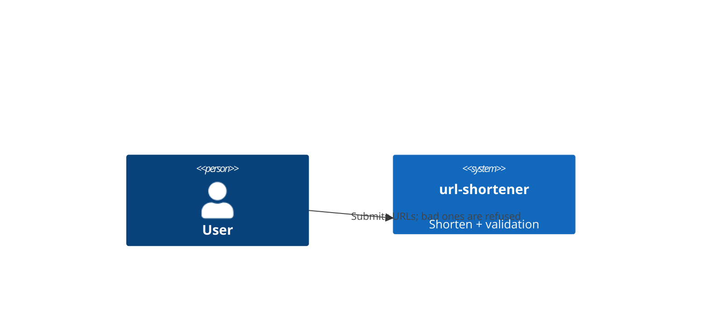
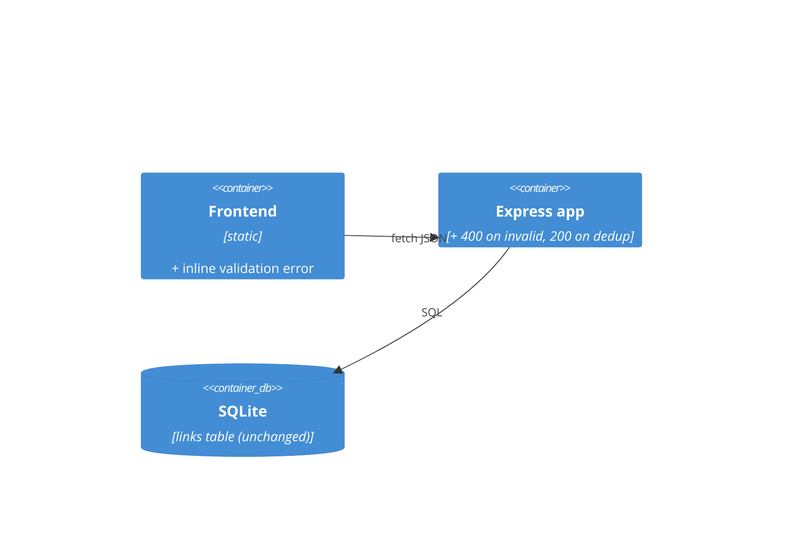
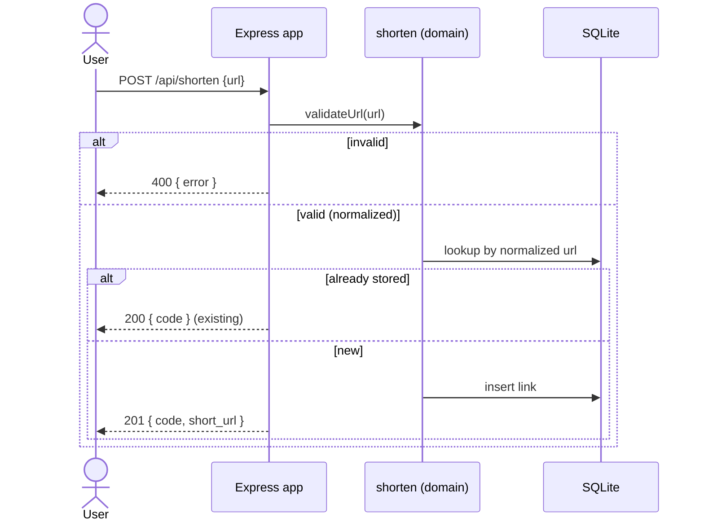

# Software Architecture Document — input-validation

## 1. Introduction and goals
Guard the create path: reject empty / unsafe-scheme / malformed / oversized URLs, normalize (trim) what is stored, and reuse the code for a URL already present.
Quality goals: **safety** (no unsafe scheme ever stored), **correctness** (happy path unchanged), **simplicity** (one domain guard, thin route).

| Role | Interest | Sign-off owner? |
|---|---|---|
| Tech Lead | validation at the domain edge, thin route, no new dep | Yes |
| Visitor | bad input refused clearly; no dead links | No |
| Contributor | a guard grown red→green, unit-testable without HTTP | No |

## 2. Constraints
**Technical:** Node ESM, Express, better-sqlite3 (per architecture-map). Use the platform `URL` parser — no new dependency.
**Organisational:** keep the guard small and obvious — it is the precedent every later validation copies.
**Conventions:** new validation → guard in `src/shorten.js`; routes stay thin (architecture-map). Error shape `res.status(400).json({ error: '<short>' })`.
**Regulatory:** none — public URLs, no personal data.

## 3. Context and scope
Same actors as base-vertical. External systems: none (no network call to the target URL — reachability is out of scope).

**C4 Context (L1):**

## 4. Solution strategy
- Add a pure domain guard `validateUrl(raw)` in `src/shorten.js`: trim → non-empty → parseable `URL` with a host → scheme in the `http`/`https` allowlist → length ≤ max. Returns the normalized URL or a typed validation error (→ [0001-reject-at-edge-allowlist-schemes.md](./adr/0001-reject-at-edge-allowlist-schemes.md)).
- `createLink` calls the guard first, then de-duplicates: if the normalized URL already has a code, return that code instead of inserting.
- `POST /api/shorten` maps a validation error to `400 { error }`, a new create to `201`, and a dedup hit to `200` with the existing code.
- Frontend shows the error message inline under the form instead of a silent failure.

## 5. Building block view
No new module — extends `shorten` (guard + dedup), `app` (400/200 mapping), `public` (error surface).

## 6. Runtime view

## 7. Deployment view
<!-- N/A: same local single-process runtime as base-vertical. -->

## 8. Crosscutting concepts
| Concept | Convention | Where defined |
|---|---|---|
| Errors | 400 with `{ error }` for invalid input | architecture-map status codes |
| Normalization | trim only; no host-case / query changes | this SAD + spec §3 |
| Scheme policy | allowlist `http`/`https` | ADR 0001 |

## 9. Architecture decisions
| # | Title | Status | Section |
|---|---|---|---|
| 0001 | Reject at the edge with a scheme allowlist (not a blocklist) | Accepted | §4 |

## 10. Quality requirements
**QG-1. Safety** — **When** a non-`http`/`https` scheme is submitted **Then** it is refused and never stored. **How verify:** AC-03 test.
**QG-2. Backwards-compat** — **When** a valid URL is submitted **Then** it shortens exactly as base-vertical (201, 7-char code). **How verify:** AC-01 test + existing seed tests stay green.
**QG-3. No duplicates** — **When** the same normalized URL is shortened twice **Then** one row, one code. **How verify:** AC-07 test.

## 11. Risks and technical debt
| Risk/debt | Severity | Mitigation | Owner |
|---|---|---|---|
| Allowlist rejects an exotic-but-legit scheme | Low | http/https covers the toy; widen later if needed | genkovich |
| Dedup lookup is a full-URL scan | Low | toy scale; add an index on url later if needed | genkovich |

Accepted debt: no reachability check; no domain blocklist (separate feature).

## 12. Glossary
| Term | Meaning |
|---|---|
| url | the original address submitted by the visitor (see `docs/CONTEXT.md`) |
| normalization | trimming surrounding whitespace before validate/store (this feature) |
