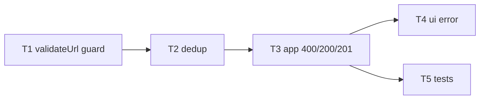

# Epic — input-validation

> **Spec:** [[../spec.md]] · **Design:** [[../sad.md]] · **ADR:** [[../adr/0001-reject-at-edge-allowlist-schemes.md]]

## Goal
Reject empty / unsafe-scheme / malformed / oversized URLs at the edge; normalize (trim) what is stored; reuse the code for a URL already present.

## Scope
- **In:** `validateUrl` domain guard, scheme allowlist, length cap, trim, dedup, 400/200/201 mapping, inline UI error.
- **Out:** reachability checks, domain blocklists, canonicalization beyond trim, rate limiting.

## Task map

## Tasks
See [tracker.md](./tracker.md) for status. Machine contract: [tasks.json](../tasks.json).

| # | Task | Layer | Blocked by | DoD (short) |
|---|---|---|---|---|
| T1 | validateUrl guard | domain | — | normalized url or typed error; pure |
| T2 | dedup | domain | T1 | same url → existing code, no insert |
| T3 | 400/200/201 mapping | app | T2 | route maps outcomes; seed tests green |
| T4 | inline UI error | ui | T3 | 400 shown under the form |
| T5 | tests | tests | T3 | npm run test:fast green, AC-01..07 covered |

## Risks / Hard rules
- **Practice step 1 anchor:** the `sdd-implement` skill drives T1 first, and the **first red→green AC is AC-02 (empty url → 400)** — smallest honest failing test before any guard code.
- Scheme policy is an **allowlist** (`http`/`https`), never a blocklist (ADR 0001).
- Route stays thin — the rule lives in `src/shorten.js`; the base schema is not touched (no migration).
