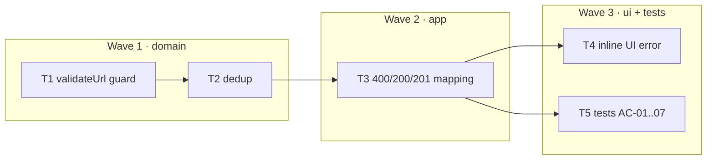

# Epic — input-validation

> **Spec:** [spec.md](../spec.md) · **Design:** [sad.md](../sad.md) · **Contract:** [openapi.yaml](../contracts/openapi.yaml) · **Test plan:** [test-plan.md](../test-plan.md) · **ADR:** [0001-reject-at-edge-allowlist-schemes.md](../adr/0001-reject-at-edge-allowlist-schemes.md)

## Goal
Reject empty, unsafe-scheme, malformed and oversized URLs at the edge; normalize (trim) what is stored; reuse the existing code when the same URL is shortened twice.

## Scope
- **In:** `validateUrl` domain guard, `http`/`https` allowlist, 2048-char cap, trim, dedup, `400`/`200`/`201` mapping, inline UI error.
- **Out:** reachability checks (no network call to the target), domain blocklists (feature `blocklist`, later), canonicalization beyond trim, rate limiting (feature `rate-limiting`).

## Task map

## Tasks
Status lives in [tracker.md](./tracker.md). Machine contract: [tasks.json](../tasks.json).

| # | Task | Layer | Wave | Blocked by | DoD (short) |
|---|---|---|---|---|---|
| T1 | validateUrl guard | domain | 1 | — | normalized URL, or `ValidationError` with a `reason`; pure |
| T2 | dedup | domain | 1 | T1 | same normalized URL → existing code, no second row |
| T3 | 400/200/201 mapping | app | 2 | T2 | route maps outcomes; existing tests stay green |
| T4 | inline UI error | ui | 3 | T3 | a 400 is shown under the form, not swallowed |
| T5 | tests AC-01..07 | tests | 3 | T3 | `npm run test:fast` green, every AC covered |

## Waves
- **Wave 1 — domain.** The rule lives in `src/shorten.js` and is unit-testable without HTTP. T2 depends on T1 (it keys on the normalized URL T1 returns), so they are ordered inside the wave, not parallel.
- **Wave 2 — app.** One thin route change: translate the domain outcome into `400` / `200` / `201`. No rule may be duplicated here.
- **Wave 3 — ui + tests.** T4 and T5 have no edge between them and may run in parallel.

## Risks / Hard rules
- **Allowlist, never a blocklist.** Scheme policy is `http`/`https` only (ADR-0001). An unknown scheme fails closed. A blocklist would silently pass whatever nobody enumerated.
- **The rule lives in the domain.** `src/shorten.js` owns `validateUrl`; `src/app.js` only maps its outcome to a status code (`docs/architecture-map.md` → Conventions → Domain vs HTTP).
- **No migration.** The base schema is untouched — dedup is a lookup, not a new column or index. At toy scale a full-URL scan is fine (SAD §11).
- **No new dependency.** The platform `URL` parser is enough (ADR-0001 → Decision drivers).
- **Dedup returns 200, not 201.** A second create is not a create. Getting this wrong makes AC-07 pass while the contract lies.
