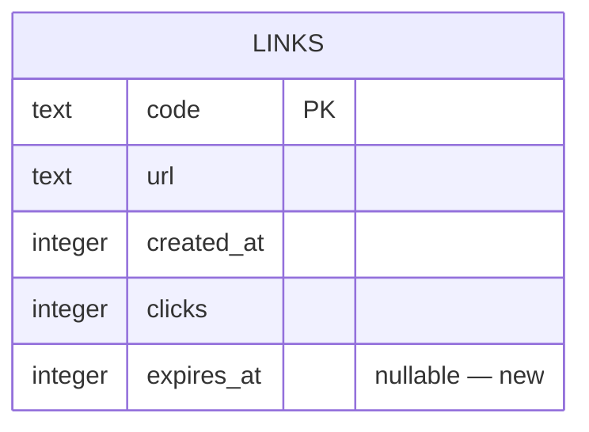

# Data model — link-expiry

## ER diagram

## Entities
### `links`
| Column | Type | Constraints | Notes |
|---|---|---|---|
| code | TEXT | PRIMARY KEY | base62/7 |
| url | TEXT | NOT NULL | original |
| created_at | INTEGER | NOT NULL | unix ms |
| clicks | INTEGER | NOT NULL DEFAULT 0 | monotonic |
| expires_at | INTEGER | NULL | unix ms; NULL only for pre-migration rows until backfilled |

**Aggregate root:** link (by code).
**Access patterns:** read by code (redirect), list all (frontend).
**Constraints:** `expires_at` compared to `Date.now()` on read.

## Indexes
| Index | Columns | Query it serves |
|---|---|---|
| (pk) | code | redirect / stats |

_No index on expires_at — read is always by code; list scan is fine at toy scale._

## Test fixtures
- valid link: `expires_at = now + 1h`
- expired link: `expires_at = now - 1h`
- legacy link: `expires_at = NULL` (pre-migration)

## Migration
Staged in `migrations/` — promoted to live by `sdd:implement` at the migration task.
- `01_add_expires_at.up.sql` — `ALTER TABLE links ADD COLUMN expires_at INTEGER;`
- `01_add_expires_at.down.sql` — rebuild table without the column (SQLite has no DROP COLUMN pre-3.35; use table-rebuild).
