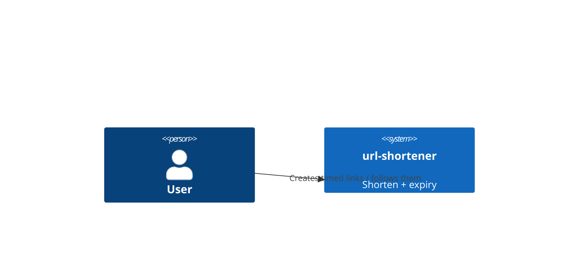
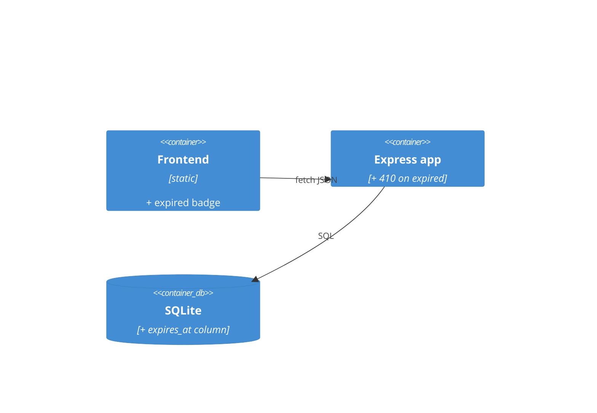
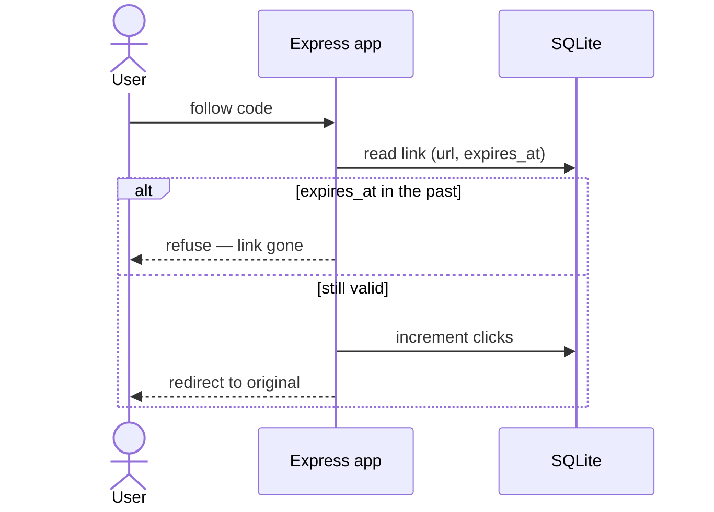

# Software Architecture Document — link-expiry

## 1. Introduction and goals
Add an optional lifetime to links; refuse expired ones on the read path; surface state in the list.
Quality goals: **correctness** (expired never redirects), **simplicity** (one column, read-path check), **backwards-compat** (existing links keep working).

| Role | Interest | Sign-off owner? |
|---|---|---|
| Tech Lead | additive migration, no schema break | Yes |
| Visitor | temporary links stop on their own | No |
| Contributor | a real additive migration + a read-path guard | No |

## 2. Constraints
**Technical:** Node ESM, Express, better-sqlite3 (per architecture-map).
**Organisational:** teaching artifact; keep the read-path guard obvious.
**Conventions:** additive migration only — never edit base schema; read-path check, no background job.
**Regulatory:** none — public URLs, no personal data.

## 3. Context and scope
Same actors as base-vertical. External systems: none.

**C4 Context (L1):**

## 4. Solution strategy
- Store `expires_at` (nullable → default resolved at create) on `links` (→ [[adr/0001-expiry-check-on-read.md]]).
- Check expiry on the follow (read) path; refuse the link when its lifetime has passed.
- List computes active/expired from `expires_at` vs now.

## 5. Building block view
No new module — extends `db` (migration), `shorten` (expiry logic), `app` (410), `public` (badge).

## 6. Runtime view

## 7. Deployment view
<!-- N/A: same local single-process runtime as base-vertical. -->

## 8. Crosscutting concepts
| Concept | Convention | Where defined |
|---|---|---|
| Errors | 410 Gone for expired | architecture-map status codes |
| Time | server `Date.now()` ms | this SAD |
| Migration | staged .up/.down promoted by implement | data-model.md |

## 9. Architecture decisions
| # | Title | Status | Section |
|---|---|---|---|
| 0001 | Expiry checked on read, not by background delete | Accepted | §4 |

## 10. Quality requirements
**QG-1. Correctness** — **When** a link's expiry has passed **Then** following it returns 410 and never redirects. **How verify:** AC-03 test.
**QG-2. Backwards-compat** — **When** the migration runs on existing links **Then** they keep resolving (default expiry applied). **How verify:** AC-04 + migration test.

## 11. Risks and technical debt
| Risk/debt | Severity | Mitigation | Owner |
|---|---|---|---|
| Default TTL undecided | Open question | agent asks human (spec §8) | human |
| Expired rows accumulate | Low | future cleanup loop (non-goal) | genkovich |

Accepted debt: no physical delete of expired links this feature.

## 12. Glossary
| Term | Meaning |
|---|---|
| expiry / TTL | see `docs/CONTEXT.md` (added by glossary step) |
