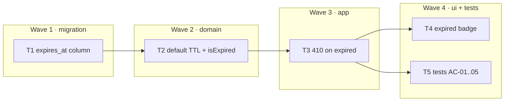

# Epic — link-expiry

> **Spec:** [spec.md](../spec.md) · **Design:** [sad.md](../sad.md) · **Data model:** [data-model.md](../data-model.md) · **Contract:** [openapi.yaml](../contracts/openapi.yaml) · **Test plan:** [test-plan.md](../test-plan.md) · **ADR:** [0001-expiry-check-on-read.md](../adr/0001-expiry-check-on-read.md)

## Goal
Give a link an optional lifetime; refuse expired links on the follow path; show each link's state in the list.

## Scope
- **In:** the nullable `expires_at` column, default-TTL resolution, `410` on an expired follow, the expired/active badge.
- **Out:** physically deleting expired rows (a future cleanup feature), editing an existing link's lifetime, per-user default policies.

## Task map

## Tasks
Status lives in [tracker.md](./tracker.md). Machine contract: [tasks.json](../tasks.json).

| # | Task | Layer | Wave | Blocked by | DoD (short) |
|---|---|---|---|---|---|
| T1 | `expires_at` column | migration | 1 | — | guarded `ALTER TABLE`; legacy rows survive |
| T2 | default TTL + `isExpired` | domain | 2 | T1 **+ open question** | boundary correct; no click on an expired follow |
| T3 | `410` on expired | app | 3 | T2 | `410` / `302` / `404`; `ttl_days` validated |
| T4 | expired badge | ui | 4 | T3 | list state matches follow behaviour |
| T5 | tests AC-01..05 | tests | 4 | T3 | `npm run test:fast` green, boundary + legacy covered |

## Waves
- **Wave 1 — migration.** One nullable column. Nothing above it can store a lifetime until it lands.
- **Wave 2 — domain.** The expiry rule and the default-TTL resolution. Blocked on a product decision, not on code.
- **Wave 3 — app.** One new status code, one new request field. No rule.
- **Wave 4 — ui + tests.** T4 and T5 have no edge between them and may run in parallel.

## Risks / Hard rules
- **Open question (spec §8): the default lifetime is undecided.** `.env.example` ships `DEFAULT_TTL_DAYS=` empty on purpose. The agent **MUST** ask the human before implementing T2. Guessing a number silently kills links.
- **`ALTER TABLE … ADD COLUMN` is not idempotent in SQLite.** A second `migrate()` raises `duplicate column name`. Guard it with `PRAGMA table_info(links)`. Without the guard the app starts exactly once.
- **Boundary is `now >= expires_at` ⇒ expired.** Fixed in test-plan.md and asserted from both sides. The choice matters more than which choice it is.
- **`expires_at IS NULL` means non-expiring**, not "expired at the epoch". That is what makes the migration additive and pre-existing links keep working (QG-2).
- **An expired follow must not count a click.** The check sits before the `UPDATE` in `resolveLink`, and both T3 and T5 pin it independently, because that `UPDATE` is what a future "optimization" will move.
- **One clock reading per request.** `resolveLink` and `listLinks` take `now` and pass it down. Two `Date.now()` calls in one follow let a link expire between the check and the increment.
- **The badge renders a decision, never makes one.** `expired` is computed by `listLinks` in the domain. No date arithmetic in `src/public/`.
