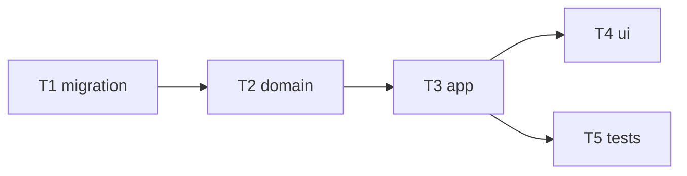

# Epic — link-expiry

> **Spec:** [spec.md](../spec.md) · **Design:** [sad.md](../sad.md) · **Data model:** [data-model.md](../data-model.md) · **ADRs:** [0001-expiry-check-on-read.md](../adr/0001-expiry-check-on-read.md)

## Goal
Give links an optional lifetime; refuse expired ones on read; show state in the list.

## Scope
- **In:** expires_at column, default-TTL resolution, 410 on expired, expired badge.
- **Out:** physical cleanup of expired rows, editing TTL, per-user policy.

## Task map

## Tasks
See [tracker.md](./tracker.md) for status. Machine contract: [tasks.json](../tasks.json).

| # | Task | Layer | Blocked by | DoD (short) |
|---|---|---|---|---|
| T1 | add expires_at | migration | — | column applied, back-compat |
| T2 | default TTL + isExpired | domain | T1 | boundary correct |
| T3 | 410 on expired | app | T2 | 410/302 + no click on 410 |
| T4 | expired badge | ui | T3 | list matches behaviour |
| T5 | tests | tests | T3 | npm run test:fast green |

## Risks / Hard rules
- **Open question (spec §8):** default TTL — agent MUST ask the human before T2 (autonomy boundary).
- Additive migration only; boundary `now >= expires_at` = expired; legacy NULL = non-expiring.
