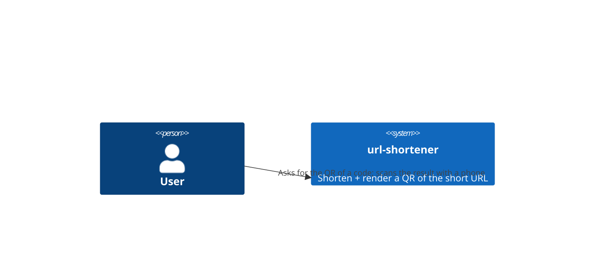
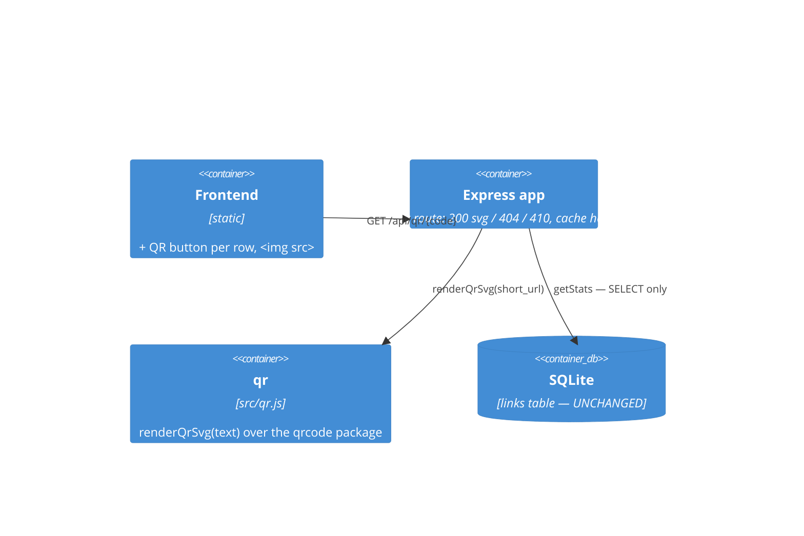
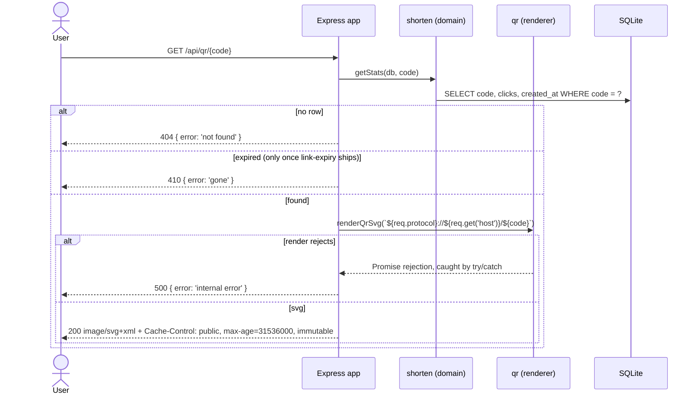

# Software Architecture Document — qr-codes

## 1. Introduction and goals
Render a QR code of a link's absolute short URL as SVG, behind the `GET /api/qr/:code` route that today answers `501`.
Quality goals: **the read path stays a read** (a QR request never touches `clicks`), **the picture agrees with the API** (what it encodes is exactly what `POST /api/shorten` advertises), **failures surface** (an async render error becomes a response, not a hung socket).

| Role | Interest | Sign-off owner? |
|---|---|---|
| Tech Lead | one dependency, argued for in an ADR; the domain file stays dependency-free | Yes |
| Visitor | a picture that scans, and a clear refusal for a link that cannot be scanned | No |
| Contributor | a worked example of a feature that *breaks* two conventions on purpose and says so | No |

## 2. Constraints
**Technical:** Node ESM, Express 4 (installed `4.22.2`), better-sqlite3, per `architecture-map.md`. No build step, so anything shipped to the browser is hand-written.
**Organisational:** `architecture-map.md` forbids a new runtime dependency *unless the feature's ADR explicitly accepts it*, and routes a new domain rule into `src/shorten.js`. This feature breaks both. Both breaks are named, argued, and carried by [0001-qrcode-dependency.md](adr/0001-qrcode-dependency.md). Neither is a `npm i` performed quietly.
**Conventions:** error shape `{ error: '<short>' }`; status codes `404` missing, `410` expired; `/api/*` routes stay above the catch-all `GET /:code`.
**Regulatory:** none.

## 3. Context and scope
Same actors as base-vertical. External systems: none — the QR is generated in-process, nothing is called over the network.

**C4 Context (L1):**

## 4. Solution strategy
- **A new module, `src/qr.js`, exporting one function:** `renderQrSvg(text)` → `Promise<string>`. It wraps `QRCode.toString(text, { type: 'svg' })` from the `qrcode` package and does nothing else. It takes no `db`, knows no route, and has no opinion about what the text means.
- **The route stays thin and becomes `async`.** `GET /api/qr/:code` probes the store with a non-mutating reader, builds the absolute short URL with the *same expression* `POST /api/shorten` already uses (`src/app.js:25`), awaits the render inside a `try/catch`, sets the cache header, and sends.
- **The store is read through `getStats`, never `resolveLink`.** `resolveLink` increments `clicks` (`src/shorten.js:32-37`); `getStats` is a bare `SELECT` that returns `null` for an unknown code. Both facts were measured against `openDb(':memory:')`.
- **No schema change, no domain rule, no new status code.** `404` and `410` are already in the map. `clicks` is untouched, so the invariant "clicks is monotonic non-decreasing" from `docs/CONTEXT.md` is not merely preserved — it is not approached.
- **SVG, not PNG.** → [0001-qrcode-dependency.md](adr/0001-qrcode-dependency.md).

## 5. Building block view
One new module, `qr`. `shorten` is **not** touched.

`architecture-map.md` says "new domain rule → `src/shorten.js`". This feature adds no domain rule. Rendering a matrix of black squares from a string is not a statement about what a link is; it is a presentation concern that happens to run on the server. The map's rule is about *where the rules of the domain live*, and putting a renderer there would answer a question nobody asked.

The module boundary also does one concrete job. `src/shorten.js` today imports exactly one thing: `randomInt` from `node:crypto`. It has no third-party dependency, which is why its unit tests are a `.js` file and an in-memory database and nothing else. `qrcode` is a third-party package with its own transitive tree. Putting `renderQrSvg` in `src/shorten.js` would drag that tree into the file every domain test imports, for a function no domain test calls. `src/qr.js` keeps the blast radius at one file: if `qrcode` is ever swapped, `git diff` names the module.

This is a **deviation** from the default convention, not an exemption from it. It is recorded here, in the ADR, and in the epic's hard rules, so that the next feature does not read `src/qr.js` as permission to scatter modules.

## 6. Runtime view

The `try/catch` is not decoration. Express 4 catches a **synchronous** throw from a handler and routes it to the error middleware; it does not observe the promise an `async` handler returns. Measured on `4.22.2`: with the handler `async () => { throw new Error(...) }`, no response is ever written — the client aborts — and with no `unhandledRejection` listener installed, Node's default kills the process before the socket is answered. Neither outcome is a `500`. Express 5 fixed this; `package.json` pins `^4.21.2`.

## 7. Deployment view
<!-- N/A: same local single-process runtime as base-vertical. Nothing is precomputed, nothing is stored on disk. -->

## 8. Crosscutting concepts
| Concept | Convention | Where defined |
|---|---|---|
| Errors | `404 { error: 'not found' }`, `410 { error: 'gone' }` | architecture-map status codes; spec §5; `link-expiry` owns the `410` string |
| Async errors | every `await` in a route sits inside `try/catch`; the `catch` calls `next(err)` | sad §6, T2 |
| Media type | `res.type('svg')`; clients match `image/svg+xml` as a prefix | spec §6 |
| Caching | `public, max-age=31536000, immutable` on `200` only | spec §5 AC-05, §11 below |
| Read purity | the QR path never calls `resolveLink` | spec §5 AC-07 |
| Payload | `${req.protocol}://${req.get('host')}/${code}`, identical to `src/app.js:25` | spec §5 AC-02 |
| Dependency | `qrcode ^1.5`, confined to `src/qr.js` | ADR 0001 |

## 9. Architecture decisions
| # | Title | Status | Section |
|---|---|---|---|
| 0001 | Take the `qrcode` dependency, and confine it behind `src/qr.js` | Accepted | §4, §5 |

## 10. Quality requirements
**QG-1. The read stays a read** — **When** a QR is requested any number of times **Then** `clicks` is unchanged. **How verify:** AC-07 test reads `GET /api/stats/:code` before and after; a Playwright test does the same through a real browser, which actually fetches the image.
**QG-2. The picture agrees with the API** — **When** a link's QR is rendered **Then** it encodes exactly the `short_url` that `POST /api/shorten` returned for it. **How verify:** AC-02 test compares the response body against `renderQrSvg(expected)` and, as a negative control, asserts it differs from `renderQrSvg(code)`.
**QG-3. No silent hang** — **When** the renderer rejects **Then** the client receives `500 { error: 'internal error' }`. **How verify:** T2 stubs `renderQrSvg` to reject and asserts the status; without the `try/catch` the test does not fail, it never finishes.

## 11. Risks and technical debt
| Risk/debt | Severity | Mitigation | Owner |
|---|---|---|---|
| A year-long `immutable` cache for a link that expires tomorrow | Medium | Accepted, and worth stating precisely. `immutable` is safe today because a code maps to exactly one address for its lifetime (`docs/CONTEXT.md` invariant), so the picture of it is a constant. Once `link-expiry` ships, a browser that cached a `200` will keep showing the QR for a link that now answers `410`. What is cached is an **image**, not a permission: scanning it performs `GET /:code`, which is where expiry is enforced. The visitor sees a QR and then sees `410`. We do not cache the `410`. | genkovich |
| `getStats`'s projection cannot answer AC-04 | Medium | Measured: `getStats` runs `SELECT code, clicks, created_at` and its rows carry exactly those three keys — no `url`, and after `link-expiry` no `expires_at`. It is the correct probe **today**, because the QR payload is built from the request, not from `links.url`. The `410` branch will need a wider non-mutating reader (widen `getStats`, or add `findLink` returning `SELECT *`), which puts `src/shorten.js` into T2's file set at that point. Recorded, not pre-built. | genkovich |
| `Host` reflected into the encoded payload | Low | Pre-existing: the same expression already produces `short_url` in every `201`. Measured with `Host: sho.rt` → `http://sho.rt/<code>`. Fix is a configured canonical base URL applied to both routes in one commit; a QR that disagrees with `short_url` would be worse than either bug alone. | genkovich |
| `trust proxy` is `false`, so a QR behind TLS termination encodes `http://` | Low | Same expression, same pre-existing defect, same fix. Measured: `X-Forwarded-Proto: https` leaves `req.protocol === 'http'`. | genkovich |
| `qrcode`'s transitive tree enters the runtime dependencies | Low | Confined to `src/qr.js`; argued in ADR 0001; `src/shorten.js` keeps importing only `node:crypto`. | genkovich |
| The `410` body string is owned elsewhere | Low | Accepted consequence, not a risk. `qr-codes` inherits `{ error: 'gone' }` from `link-expiry`, which introduces `expires_at` and defines the condition; this feature only observes it. If `link-expiry` ever renames the string, both packages change together — that is the price of one condition having one name, and it is cheaper than two. | genkovich |

Accepted debt: no PNG, no sizing, no download. The picture is a picture; anything more is a new feature.

## 12. Glossary
| Term | Meaning |
|---|---|
| QR code | a two-dimensional barcode encoding a text payload; here, always a link's absolute short URL |
| payload | the text a QR encodes. Not the SVG markup, and not the link's original address |
| non-mutating reader | a store function that only reads. `getStats` is one; `resolveLink` is not (see `docs/CONTEXT.md` → click) |
