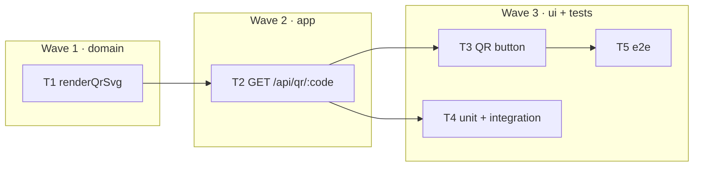

# Epic — qr-codes

> **Spec:** [spec.md](../spec.md) · **Design:** [sad.md](../sad.md) · **Contract:** [openapi.yaml](../contracts/openapi.yaml) · **Test plan:** [test-plan.md](../test-plan.md) · **ADR:** [0001-qrcode-dependency.md](../adr/0001-qrcode-dependency.md)

## Goal
Turn the `501` on `GET /api/qr/:code` into a QR code of the link's absolute short URL, rendered as SVG. No schema change, no domain rule, no new status code — and no click.

## Scope
- **In:** the `qrcode` dependency behind a new `src/qr.js`, the async route with its cache header and `404`, a QR button on each row of the links table, unit + integration + e2e coverage.
- **Out:** PNG or `data:` URLs, size/colour/margin/logo options, a download button, bulk QR for the whole table, any server-side or CDN cache.

## Task map

## Tasks
Status lives in [tracker.md](./tracker.md). Machine contract: [tasks.json](../tasks.json).

| # | Task | Layer | Wave | Blocked by | DoD (short) |
|---|---|---|---|---|---|
| T1 | `renderQrSvg` | domain | 1 | — | one module, one function, one dependency; `src/shorten.js` untouched |
| T2 | `GET /api/qr/:code` | app | 2 | T1 | `getStats` not `resolveLink`; `try/catch` around the `await`; cache header |
| T3 | QR button | ui | 3 | T2 | ``, no `.svg` suffix, no rule in the browser |
| T4 | unit + integration | tests | 3 | T2 | payload compared, clicks compared, media type matched as a prefix |
| T5 | e2e | tests | 3 | T3 | the picture loads in a real browser, and the counter does not move |

## Waves
- **Wave 1 — domain.** The renderer knows nothing about HTTP and nothing about the store. It is written and pinned first so that T2 has one thing left to get right.
- **Wave 2 — app.** The only HTTP change. One route body, one new header, one `try/catch`.
- **Wave 3 — ui + tests.** T4 depends only on T2 and may start the moment the route lands. T5 waits for T3, because it drives the button. T3 and T4 have no edge between them and run in parallel.

## Risks / Hard rules

- **A QR request is not a click. Never call `resolveLink`.** It increments `clicks` — measured against `openDb(':memory:')`, two calls take the counter from `0` to `2`. Its name fits the job perfectly, which is the trap: it is the function that turns a code into a link. The QR route uses `getStats`, a bare `SELECT` that returns `null` for an unknown code. A route built on `resolveLink` answers `200` with a valid SVG and passes every test anyone would think to write, while the frontend inflates the counter on every table render. AC-07 exists for exactly this, and it is the only assertion that catches it.

- **The route is `async`, so it needs an explicit `try/catch`.** Express 4 catches a synchronous `throw` from a handler and routes it to the error middleware; it never looks at the promise an `async` handler returns. Measured on `4.22.2`, the version installed here: with `async () => { throw ... }` no response is ever written, the client aborts, and with no `unhandledRejection` listener Node's default kills the process before the socket is answered. The `catch` calls `next(err)`, and the existing error middleware turns it into `500 { error: 'internal error' }`. Express 5 fixed this; `package.json` declares `^4.21.2`.

- **Encode the absolute short URL, not the code.** `renderQrSvg(code)` produces a flawless, scannable QR whose payload is the string `kmnj8D9`. The route must build `` `${req.protocol}://${req.get('host')}/${code}` `` — character for character the expression `src/app.js:25` already uses for `short_url`. If the two ever diverge, the picture points somewhere the API never advertised. AC-02's test compares the body against a known-good render of the expected URL, and against a render of the bare code as a negative control.

- **`await` the render.** `res.send(promise)` answers `200` with the body `[object Promise]` and the media type `image/svg+xml`. Only an assertion on the body catches it.

- **Match the media type as a prefix.** `res.send()` on a string appends `; charset=utf-8` (measured), so the wire header is `image/svg+xml; charset=utf-8`. A strict equality assertion fails, and the cheapest way to make it pass is `res.end()` — which quietly drops Express's ETag (`app.get('etag')` is `"weak"` by default). Fix the assertion, not the response.

- **`Cache-Control: … immutable` is a promise about the picture, not about the link.** It is safe because a code maps to exactly one address for its lifetime (`docs/CONTEXT.md`), so the QR of a code is a constant. Once `link-expiry` ships, a browser holding a cached `200` will keep showing the QR of a link that now answers `410`. This is accepted: the cache holds an **image**, not a permission. Scanning it performs `GET /:code`, which is where expiry is enforced, and that `410` is never cached. What must not happen is caching the refusal — the header goes on the `200` only.

- **`getStats` is the right probe today and will not be enough for `410`.** Measured: it runs `SELECT code, clicks, created_at`, and its rows carry exactly those three keys. No `url` — which is fine, because the payload is built from the request, not from `links.url`. No `expires_at` either, which is why the `410` branch will need a wider non-mutating reader (widen `getStats`, or add `findLink` returning `SELECT *`) and will pull `src/shorten.js` into T2's file set at that point. Do not build it now.

- **The `410` branch does not exist until `link-expiry` ships,** and when it does, its body is `{ error: 'gone' }` (AC-04) — the string that feature already uses for the same condition on `GET /:code`. `link-expiry` introduces `expires_at` and decides what an expired link is; `qr-codes` only observes that decision, so it does not get to name it a second time. Until then: no branch, no test, no guess. See [link-expiry spec §5](../../link-expiry/spec.md#5-acceptance-criteria).

- **Two conventions are broken here on purpose.** `architecture-map.md` forbids a new runtime dependency without an ADR that accepts it, and routes new server logic into `src/shorten.js`. This feature takes `qrcode` and puts the renderer in a new `src/qr.js`. Both breaks are argued in [0001-qrcode-dependency.md](../adr/0001-qrcode-dependency.md) and in [sad.md](../sad.md#5-building-block-view). `src/shorten.js` must still import nothing but `node:crypto` when this epic closes — that is the check that the boundary held. A new module per function is *not* what this licenses.

- **Never append `.svg` to the code.** Express captures the whole path segment, so `/api/qr/abc.svg` looks up a link whose code is the literal `abc.svg` and answers `404` (measured). The browser needs no suffix; `` works because the response says what it is.
