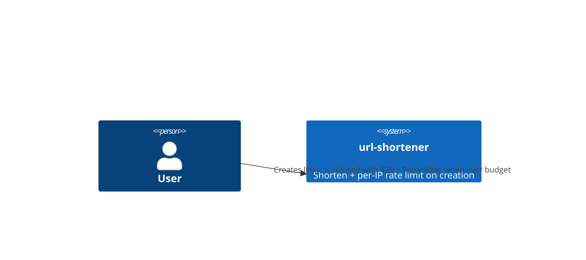
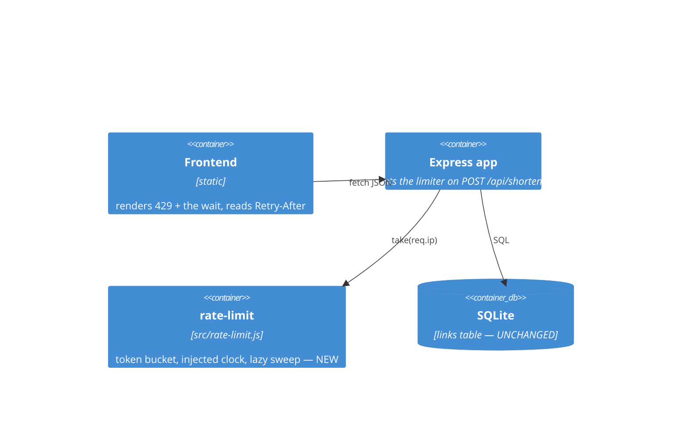
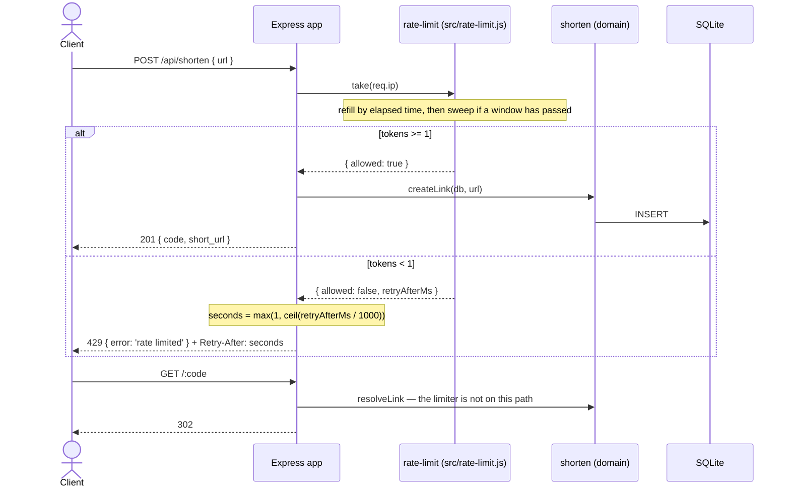

# Software Architecture Document — rate-limiting

## 1. Introduction and goals
Bound the write side of the service by client address. A token bucket per address, held in the process heap, refilled by the clock; over budget, `429` plus `Retry-After`.

Quality goals: **reads never refused** (a redirect that can be rate-limited is a broken link), **no new dependency** (the arithmetic is forty lines), **testable without sleeping** (the clock is a parameter), **bounded memory** (a bucket that carries no information is deleted).

| Role | Interest | Sign-off owner? |
|---|---|---|
| Tech Lead | zero new dependencies; no timer holding the process open; the state cannot grow forever | Yes |
| Visitor | ordinary use untouched; a clear, actionable refusal when a script misbehaves | No |
| Operator | the effective limit is visible at boot; `trust proxy` is their decision and is documented | No |
| Contributor | a worked example of injecting a clock so that a time-shaped rule is testable in microseconds | No |

## 2. Constraints
**Technical:** Node ESM, Express 4, better-sqlite3 (`docs/architecture-map.md`). **No new runtime dependency** — unlike `qr-codes`, this feature does not need to negotiate that convention, and ADR-0001 explains why `express-rate-limit` would be a cost rather than a saving.
**Organisational:** the service is single-process. The moment it is not, the limit multiplies by the number of workers (§11).
**Conventions:** error shape `{ error: '<short>' }`; status codes from the architecture map, which has reserved `429 rate-limit` since bootstrap; `/api/*` routes stay above the catch-all `GET /:code`; TDD, every task opens red.
**Protocol:** `Retry-After` is defined by RFC 9110 §10.2.3. Its `delay-seconds` form is `1*DIGIT` — a non-negative integer. `429 Too Many Requests` is RFC 6585 §4.
**Regulatory:** none, though an IP address is personal data in some jurisdictions; it never leaves the heap (spec §6.1).

## 3. Context and scope
Same actors as base-vertical. External systems: none. New external *input*: the client's network address, taken from the socket.

**C4 Context (L1):**

## 4. Solution strategy
- **Token bucket, in the heap.** A `Map` from client address to `{ tokens, lastRefillMs }`. Capacity `max`; refill rate `max / windowMs` tokens per millisecond, applied lazily on touch rather than by a ticker (→ [0001-in-memory-token-bucket.md](adr/0001-in-memory-token-bucket.md)).
- **The clock is a parameter.** `createRateLimiter({ max, windowMs, now = Date.now })`. Without this, a test of AC-04 either sleeps for a real second or fakes `Date` globally; the second option is worse than it looks (§8).
- **The limiter is injected into the app.** `createApp(db, { rateLimiter })`, exactly as `db` already is. The integration suite cannot vary its own IP (§6), so it varies the limiter instead.
- **`take(key)` is the whole surface.** It returns `{ allowed: true }` or `{ allowed: false, retryAfterMs }` with `retryAfterMs` strictly positive. Seconds, ceilings and headers are HTTP's business and live in `src/app.js`.
- **The sweep is lazy and amortised.** On each `take`, if a full `windowMs` has passed since the last pass, walk the `Map` once and delete every bucket untouched for at least `windowMs`. No `setInterval`.
- **One route.** The middleware is mounted on `POST /api/shorten` only. Read paths never see it.
- **The frontend renders the refusal.** It reads `Retry-After` from the response and composes a sentence. It knows no rule.

## 5. Building block view
**A new module, `src/rate-limit.js`.** This is a deliberate departure from `docs/architecture-map.md` → Conventions, which says *new domain rule → `src/shorten.js`*. It is named as a departure rather than left to be discovered.

A rate limit is not a rule about links. `src/shorten.js` states what a link is and what makes one valid; nothing in it knows the time of day, and nothing in it remembers a previous request. A token bucket is the opposite on both counts: it is a clock and an accumulator, and it would drag `Date.now`, a mutable `Map` and a per-process lifetime into the one module the project has kept pure. What it limits is not links but *requests*, which is a fact about the transport. Putting it in `src/shorten.js` would mean the domain module could no longer be understood without knowing how often it is called.

So: a module boundary, one file, `src/rate-limit.js`, importing nothing from Express and nothing from the domain. `src/app.js` mounts it. `src/shorten.js` never learns it exists.

`src/shorten.js` does not appear in the diagram because it is not touched. That is the point of the boundary.

## 6. Runtime view

## 7. Deployment view
Same local single-process runtime as base-vertical. Two properties of a *real* deployment are load-bearing and are not decided here:

- Behind a reverse proxy, `req.ip` is the proxy unless `app.set('trust proxy', …)` is configured. Setting it to `true` hands the key to the client (§11). The correct value is the hop count, or `'loopback'`, and it depends on the topology.
- More than one process serving `POST /api/shorten` means more than one limiter (§11).

## 8. Crosscutting concepts
| Concept | Convention | Where defined |
|---|---|---|
| Errors | `429 { error: 'rate limited' }` | architecture-map status codes; spec §5 AC-02 |
| Retry-After | integer seconds, `>= 1`, computed in `src/app.js` | RFC 9110 §10.2.3; spec §6 |
| Client identity | `req.ip`, from the socket, never from a header | spec §6.1 |
| Clock | injected: `createRateLimiter({ now })`, default `Date.now` | §4, ADR-0001 |
| Configuration | `process.env` read once, in `src/app.js`; `src/rate-limit.js` never touches `process` | spec §5 AC-06 |
| Bucket lifetime | deleted after `windowMs` of idleness, by a lazy pass on write | ADR-0001 |

**Why the clock is a parameter and not `vi.useFakeTimers()`.** Faking `Date` globally would also fake it for `createLink`, which stamps `created_at` with `Date.now()`. Measured: with `Date.now` frozen, five links share one `created_at`, and `listLinks`' `ORDER BY created_at DESC` stops being a total order — SQLite returned insertion order in that run, which is exactly the accident a test must not rely on. An injected clock reaches the limiter and nothing else.

**Why `process.env` is read in `src/app.js` and not in `src/rate-limit.js`.** `src/app.js` is the composition root: it is where `db` arrives and where routes are mounted. Reading the environment there follows the precedent already in `src/db.js`, whose `openDb(path = process.env.DB_PATH || 'data/links.db')` defaults from the environment inside a factory. Keeping `process` out of `src/rate-limit.js` is what lets its tests construct a limiter with three literal numbers and no `beforeEach` that saves and restores globals.

## 9. Architecture decisions
| # | Title | Status | Section |
|---|---|---|---|
| 0001 | In-memory token bucket, hand-rolled, over Redis or `express-rate-limit` | Accepted | §4 |

## 10. Quality requirements
**QG-1. Reads are never refused** — **When** a client's bucket is empty **Then** `GET /:code`, `GET /api/links`, `GET /api/stats/:code` and `/healthz` answer as usual. **How verify:** AC-05 integration test drains the bucket through the injected limiter, then drives all four routes.

**QG-2. A refusal writes nothing** — **When** `429` is returned **Then** the row count is unchanged. **How verify:** AC-02 test counts rows through `GET /api/links`, not by reading the source.

**QG-3. Back-off is correct** — **When** a client waits exactly `Retry-After` seconds **Then** the next request is accepted. **How verify:** unit test over the injected clock, across capacities and clock offsets. Verified in design across `max` ∈ {1, 5, 60, 250, 1000, 5000}; the smallest header ever emitted was `1`, and no obedient client was refused twice.

**QG-4. Bounded state** — **When** an address has been idle for `windowMs` **Then** its bucket is gone. **How verify:** unit test asserts `size()` falls back to zero after the clock advances past a window and one further `take` runs the sweep.

**QG-5. Backwards-compat** — **When** fewer than `max` requests are made **Then** behaviour is byte-identical to before. **How verify:** `tests/unit/shorten.test.js` and `tests/integration/shorten.test.js` pass unmodified.

**QG-6. No timer** — **When** the test process finishes **Then** it exits on its own. **How verify:** `npm run test:fast` returns. Measured: `setInterval(fn, 1000)` without `.unref()` keeps Node alive indefinitely; the same call with `.unref()` exits immediately. The design has no timer at all, so neither applies.

## 11. Risks and technical debt
| Risk/debt | Severity | Mitigation | Owner |
|---|---|---|---|
| Behind a reverse proxy, `req.ip` is the proxy: the whole internet becomes one client and the first `max` requests exhaust it for everybody | High | `app.set('trust proxy', <hop count>)` at deploy. **Never `true`** — measured: with `trust proxy: true` and `X-Forwarded-For: 9.9.9.9, 8.8.8.8`, `req.ip` is `9.9.9.9`, the value the client chose, and the limit becomes a formality. With `1` it is `8.8.8.8`. Accepted debt: this repo runs no proxy. | genkovich |
| State is per process. Two workers → two limiters → an effective limit of `max × workers`, and which one a client meets is unspecified | Medium | Acceptable while exactly one process serves `POST /api/shorten`. It becomes a **bug**, not a debt, the moment a second one does: a cluster, a replica count above 1, a rolling deploy that overlaps old and new, or any serverless target. At that point ADR-0001's rejected Redis option is reopened. | genkovich |
| Restarting the service refills every bucket | Low | Accepted. A limit that survives a deploy needs a datastore (ADR-0001). | genkovich |
| A malformed JSON body is answered `400` by `express.json()` before the route middleware runs, so it costs no token | Low | Measured: the limiter executed zero times for such a request. It creates no link and the parse is capped by the 100 kB default body limit, so the write side stays protected. Mounting the limiter above `express.json()` would close it and would also make a `429` outrank a `400`, which is a worse contract. Accepted, documented in T2. | genkovich |
| An IPv6 client rotates through its `/64`, taking a fresh bucket per request at ~285 bytes each | Low | The sweep bounds residency to one window of traffic. Keying on the `/64` prefix closes it properly; out of scope. | genkovich |
| The sweep is O(n) and runs on a request | Low | Amortised to at most one pass per `windowMs`. Measured: 15.6 ms for 100 000 entries, so under a minute-long window the worst request pays 15.6 ms once per minute. If that ever matters, the fix is a second `Map` used as a generation buffer, not a timer. | genkovich |
| `RATE_LIMIT_*` are documented in `.env.example`, but nothing loads `.env` | Medium | Measured: no `dotenv` dependency and no `--env-file` flag anywhere in `package.json`, `src/`, `scripts/` or `.github/`. The variables take effect only when exported into the environment, or via `node --env-file=.env` (Node ≥ 20.6; verified). The boot line printing the effective pair (AC-06) is how an operator finds this out in one second instead of one afternoon. | genkovich |

Accepted debt: no shared state, no per-account quota, no `X-RateLimit-*` headers, no `/64` prefix keying, and `trust proxy` left unset.

## 12. Glossary
| Term | Meaning |
|---|---|
| bucket | the per-address pair `{ tokens, lastRefillMs }`. Not a queue; nothing is stored in it but a number and a timestamp |
| token | the right to make one `POST /api/shorten`. Consumed on acceptance, never on refusal |
| capacity | `RATE_LIMIT_MAX` — the bucket ceiling, and therefore the largest burst a rested client may make |
| window | `RATE_LIMIT_WINDOW_MS` — the time in which a bucket refills from empty to full. Not a calendar interval; nothing resets on its boundary |
| refill | tokens added on touch, proportional to elapsed time. Fractional on purpose (spec §6) |
| sweep | the lazy pass that deletes buckets idle for at least one window. Safe because such a bucket is provably full, and a full bucket is indistinguishable from an absent one |
| key | the string identifying a client: `req.ip`. Not an authenticated identity |
