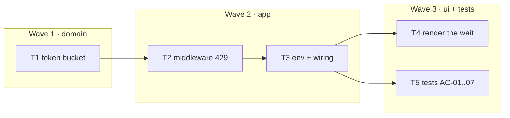

# Epic — rate-limiting

> **Spec:** [spec.md](../spec.md) · **Design:** [sad.md](../sad.md) · **Contract:** [openapi.yaml](../contracts/openapi.yaml) · **Test plan:** [test-plan.md](../test-plan.md) · **ADR:** [0001-in-memory-token-bucket.md](../adr/0001-in-memory-token-bucket.md)

## Goal
Bound `POST /api/shorten` by client address: a token bucket per IP, held in the process heap, refilled by the clock. Over budget → `429` and a `Retry-After` a client can obey. Reads are never refused.

## Scope
- **In:** `src/rate-limit.js` (bucket, injected clock, lazy sweep), the middleware on one route, `429` + `Retry-After`, env configuration, the message in the form.
- **Out:** limiting reads, shared state across processes, `X-RateLimit-*` headers, per-account quotas, choosing `trust proxy`, banning anyone.

## Task map

## Tasks
Status lives in [tracker.md](./tracker.md). Machine contract: [tasks.json](../tasks.json).

| # | Task | Layer | Wave | Blocked by | DoD (short) |
|---|---|---|---|---|---|
| T1 | token bucket | domain | 1 | — | fractional refill; `retryAfterMs > 0`; lazy sweep, no timer |
| T2 | middleware | app | 2 | T1 | one route only; `Retry-After` a positive integer; zero writes |
| T3 | env + wiring | app | 2 | T2 | `Number`, not `parseInt`; defaults `60`/`60000`; effective pair printed at boot |
| T4 | render the wait | ui | 3 | T3 | reads `Retry-After`; no rule in the browser |
| T5 | tests AC-01..07 | tests | 3 | T3 | `npm run test:fast` green; three mutations each go red |

## Waves
- **Wave 1 — domain.** The bucket is arithmetic over an injected clock. It is written and tested before HTTP exists, because every remaining decision assumes `retryAfterMs` is strictly positive.
- **Wave 2 — app.** T3 depends on T2: the limiter must be injectable before there is anything to configure. Ordered inside the wave, not parallel.
- **Wave 3 — ui + tests.** T4 and T5 share no edge and may run in parallel.

## Risks / Hard rules

- **The refill is fractional. Never whole tokens with a clock reset.** `tokens += floor(elapsed / msPerToken); last = now` throws away the remainder on every call. Measured: a client polling every 999 ms is then granted **0** requests over the next 60 s — forever — where the fractional refill grants 59. Polling at exactly 1000 ms hides it completely (60 both ways), so a test whose interval divides the token period proves nothing. T5 pins this with a 750 ms poll against a 500 ms token.

- **`Retry-After` is a positive integer, and `Math.ceil` is why.** A refused client holds under one token, so the deficit is positive, so the ceiling is at least `1`. `Math.round` and `Math.floor` are not: at `RATE_LIMIT_MAX=1000` a token accrues every 60 ms and `round(0.06) === 0`. Express ships whatever it is handed — `0` sends `0`, `0.06` sends `0.06`, `NaN` sends `NaN`, none of them throwing. `Retry-After: 0` is legal and means *retry now*, so the refusal becomes a busy-wait. Keep the `Math.max(1, …)`; it is a tripwire on the next refactor, not the thing that makes the invariant true.

- **The sweep is a lazy pass on write. Never `setInterval`.** Measured: `setInterval(fn, 1000)` keeps Node alive until it is killed; `.unref()` makes it exit at once. A timer in `createRateLimiter` would hang `npm run test:fast` in every suite that builds an app, and `.unref()` would trade the hang for a sweep that fires at the event loop's convenience.

- **Never delete a bucket that is not full.** Deleting one grants its owner a full bucket, because an absent bucket is created full. This is safe for an idle bucket and only for an idle one: from empty, `windowMs` of refill adds exactly `max` tokens — exact equality checked for `max` ∈ {1, 3, 7, 60, 97, 1000, 60000}. So the predicate is idleness, `now - lastRefillMs >= windowMs`, and fullness is a theorem rather than a second condition. Without the sweep each address costs ~285 bytes forever: 10⁶ idle addresses is 272 MiB of buckets all saying "full permission".

- **Every supertest request comes from the same IP.** Measured: `::ffff:127.0.0.1`, from any number of agents, and unchanged by an `X-Forwarded-For` header, because `trust proxy` is false and Express is right to ignore it. **The integration suite is one client.** AC-03 (per-IP isolation) is therefore a unit test over `take(key)`. This is the whole reason the limiter is *injected* into `createApp`: the HTTP tests shrink the budget instead of faking an address. There is no other seam.

- **`req.ip` is a deployment property, and `trust proxy: true` is a bypass, not a fix.** Behind a proxy with the setting unset, everybody shares one bucket. Set to `true`, the key comes from a header the client writes: measured, `X-Forwarded-For: 9.9.9.9, 8.8.8.8` yields `req.ip === '9.9.9.9'`; with `trust proxy: 1` it yields `8.8.8.8`. This feature does not set it. Whoever deploys behind a proxy sets the hop count, and reads `sad.md` §11 first.

- **The state is per process.** Two workers give a client `2 × max`, and which worker it meets is unspecified. Acceptable while exactly one process serves this route; a **bug** the moment a second one does — a cluster, a replica count above 1, or a rolling deploy that overlaps two versions. That is the day ADR-0001's Redis option reopens.

- **`parseInt` is the wrong parser.** `parseInt('1e3', 10) === 1`. `parseInt('60abc', 10) === 60`. And `Number(raw) || 60` turns `'0'` into `60` while accepting `'-5'`. Use `Number`, then `Number.isInteger(n) && n > 0`, then the default. A bad `RATE_LIMIT_WINDOW_MS` reaches the wire as `Retry-After: NaN`, because `Math.max(1, NaN)` is `NaN` and Express sends it happily.

- **Nothing in this repo loads `.env`.** No `dotenv`, no `--env-file` — checked across `package.json`, `src/`, `scripts/` and `.github/`. Copying `.env.example` to `.env` changes nothing; the variables must be exported, or Node must be started with `--env-file=.env` (≥ 20.6). T3 prints the effective pair at boot so this costs an operator one second rather than one afternoon.

- **No new dependency.** Forty lines of arithmetic. If this feature finds itself editing `package.json`, read ADR-0001 again: `express-rate-limit` keeps its state in a process-local `Map` too, so it would import the one weakness we have and hide the reason to document it.

- **`src/shorten.js` is not touched.** The limiter is a transport concern, not a rule about links. If a diff here reaches the domain module, the boundary in `sad.md` §5 has been crossed by accident.
